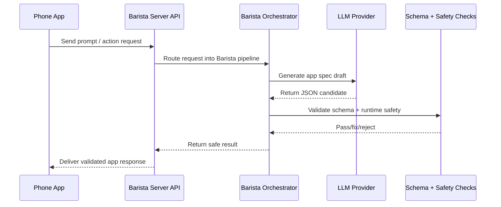
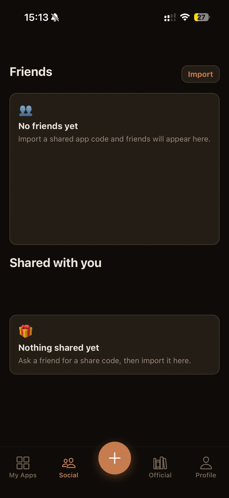
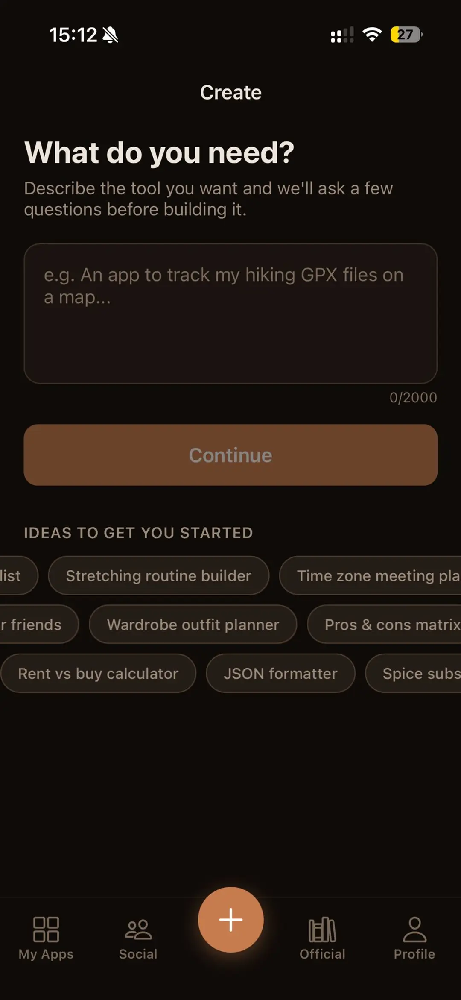
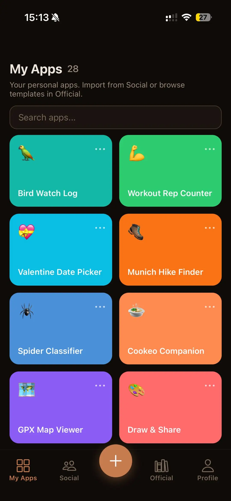
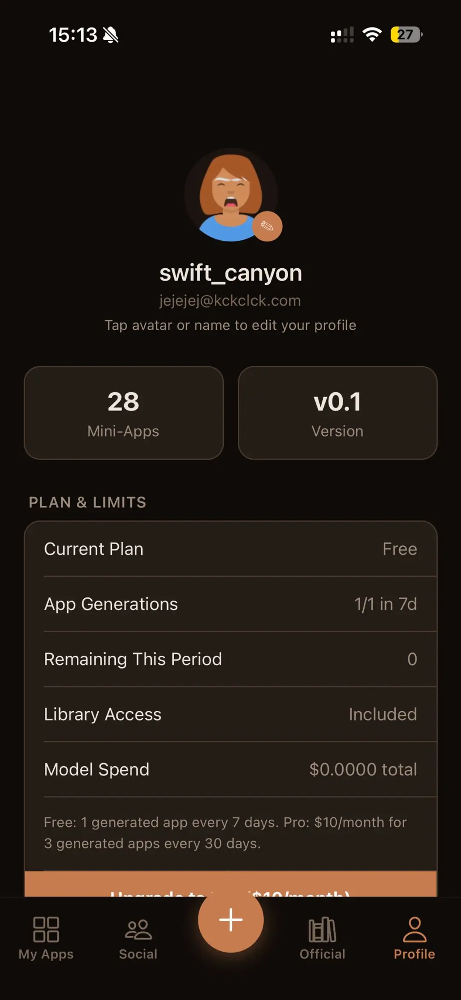
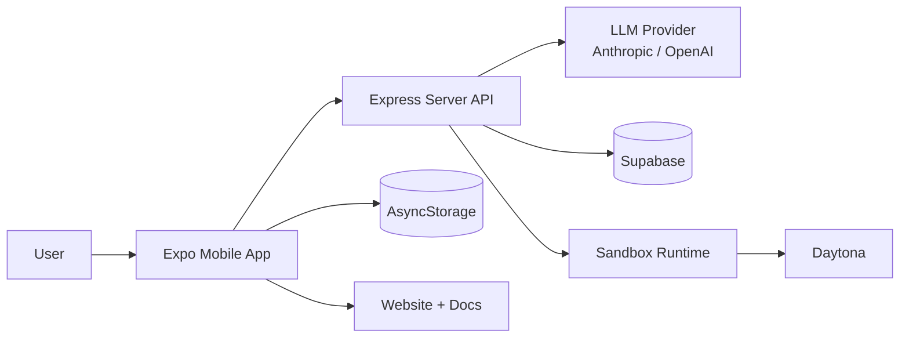
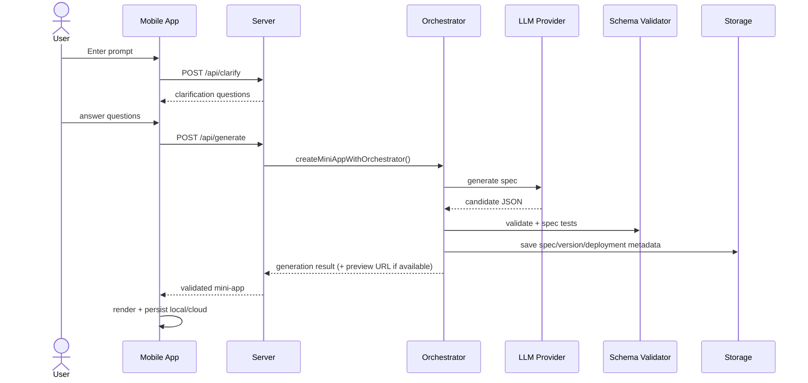
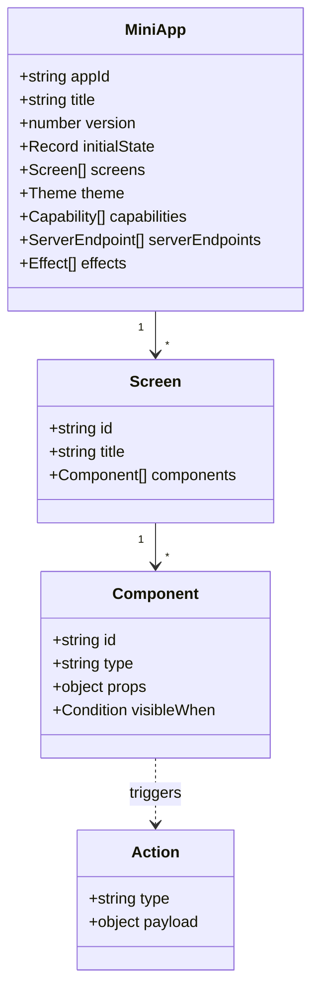

# Baristapp

### Phone ↔ Server Flow (How Barista Handles It)



[](https://github.com/wartelth/baristapp)
[](https://github.com/wartelth/baristapp/network/members)
[](https://github.com/wartelth/baristapp/issues)
[](https://github.com/wartelth/baristapp/commits)
[](./LICENSE)

Build mobile mini-apps from plain English prompts.

Baristapp generates declarative JSON app specs, validates them with shared schemas, then renders them safely in the mobile app (no eval / no remote code execution).

**Links:** [Repository](https://github.com/wartelth/baristapp) · [Issues](https://github.com/wartelth/baristapp/issues) · [Pull Requests](https://github.com/wartelth/baristapp/pulls) · [Actions](https://github.com/wartelth/baristapp/actions)

> Status: Beta (active development)  
> Platforms: Expo/React Native app + Node/Express API + docs/website monorepo

### Quick Start (60 seconds)

```bash
npm install
# create server/.env from server/.env.example and set at least one LLM key
npm run server
npm run app
```

## Website Screenshots

| Social Tab | Create Flow |
| --- | --- |
|  |  |
| My Apps Grid | Profile & Plan |
|  |  |

- Repo: `https://github.com/wartelth/baristapp`
- Monorepo: React Native app + Node/Express server + shared schema + docs + website
- Core idea: AI generates declarative JSON specs, app renders them safely (no eval / no remote code execution)

## Table of Contents

- Overview
- Monorepo Structure
- Tech Stack
- Quick Start
- Scripts
- Configuration & Environment
- Architecture
- AI Runtime: Native Worker, Aider, Daytona
- Data Model
- API Surface
- Development Workflow
- Troubleshooting
- Contributing

## Overview

Baristapp lets users describe a tool (for example, "a workout tracker with weekly charts"), then generates a fully interactive mini-app.  
The generated output is JSON, validated by shared schemas, and interpreted by a generic renderer in the mobile app.

Key capabilities:

- Prompt clarification + generation + modification
- Declarative UI with many component/action types
- Local + cloud state/spec persistence
- Sharing/import flows for mini-apps
- Optional sandbox deployment runtime

## Monorepo Structure

```text
baristapp/
├─ app/        # Expo / React Native client
├─ server/     # Express API + orchestration + runtime
├─ shared/     # Shared schema and types (@baristapp/shared)
├─ docs/       # Docusaurus docs site
├─ website/    # Next.js marketing/showcase website
├─ baristapp.config.js
└─ package.json
```

## Tech Stack

- **Mobile app:** Expo, React Native, React Navigation
- **Server:** Node.js, Express, TypeScript
- **AI providers:** Anthropic + OpenAI (provider-selectable)
- **Schema/validation:** Zod + JSON schema
- **Storage:** AsyncStorage (app), Supabase (server-backed cloud)
- **Docs/Web:** Docusaurus + Next.js

## Quick Start

### 1) Install dependencies

```bash
npm install
```

### 2) Configure app runtime

Edit `baristapp.config.js`:

- `apiBaseUrl` (backend URL)
- `supabaseUrl`
- `supabaseAnonKey`
- optional billing/support/privacy settings

### 3) Configure server environment

Create `server/.env` from `server/.env.example` (copy the file manually or with your shell command).

Set at least one LLM key in `server/.env`:

- `ANTHROPIC_API_KEY` and/or
- `OPENAI_API_KEY`

Optional but recommended:

- `SUPABASE_URL`
- `SUPABASE_SECRET_KEY`

### 4) Run services

In separate terminals:

```bash
npm run server
npm run app
```

### 5) Optional sites

```bash
npm run docs
```

```bash
cd website && npm install && npm run dev
```

## Scripts

Root scripts (`package.json`):

- `npm run server` -> runs `server` workspace dev server
- `npm run app` -> starts Expo app workspace
- `npm run docs` -> starts docs workspace
- `npm run docs:build` -> builds docs workspace
- `npm run typecheck` -> type-checks shared + server

Useful workspace scripts:

- `npm run test --workspace=server`
- `npm run build --workspace=docs`
- `cd website && npm run lint`
- `cd website && npm run build`

## Configuration & Environment

### App config (`baristapp.config.js`)

Main runtime values consumed by the app:

- `debug`
- `apiBaseUrl`
- `supabaseUrl`
- `supabaseAnonKey`
- billing/revenueCat fields

### Server env (`server/.env`)

Important variables:

- `PORT` (default `3001`)
- `LLM_PROVIDER` (`claude` or `openai`)
- `ANTHROPIC_API_KEY`
- `OPENAI_API_KEY`
- `OPENAI_CODING_MODEL`
- `OPENAI_SMALL_MODEL`
- `SUPABASE_URL`
- `SUPABASE_SECRET_KEY`

Runtime/orchestration:

- `AGENT_EXECUTOR_MODE` (`native` or `aider`)
- `AIDER_EXECUTION_TARGET` (`auto`, `local`, `daytona`)
- `AIDER_MODEL`
- `AIDER_TIMEOUT_MS`
- `SANDBOX_RUNTIME_MODE` (`auto` or `local`)
- `DAYTONA_API_URL`
- `DAYTONA_API_KEY`
- `SERVER_PUBLIC_BASE_URL`

## Architecture

### UML Component Diagram



### UML Sequence Diagram (Generate Flow)



### UML Class Diagram (Core Spec Shape)



## AI Runtime: Native Worker, Aider, Daytona

### 1) Native worker (default)

- `AGENT_EXECUTOR_MODE=native`
- Uses provider abstraction (`claude` / `openai`)
- Iterative draft/repair/test loop (`runAgentWorker`)
- Applies schema + runtime safety checks before success

### 2) Aider worker (optional)

- Enable with `AGENT_EXECUTOR_MODE=aider`
- Orchestrator calls `runAiderWorker`
- Aider writes `app_spec.json` from task + schema instructions
- Supports retries and fallback to native worker when configured

### 3) Daytona integration (optional)

Two separate integration points:

- **Aider execution target:** `AIDER_EXECUTION_TARGET=daytona` (or `auto`)
- **Sandbox deployment runtime:** via `deployMiniAppToSandbox`

Behavior:

- If Daytona is configured (`DAYTONA_API_URL` + `DAYTONA_API_KEY`), server can create sandboxes, write files, and execute commands.
- If not configured (or forced local), runtime falls back to local endpoint mounting mode.

## Data Model

Shared schemas live in `shared/src/schema.ts` and power both app and server.

- Component/action unions are schema-first.
- App and server both consume `@baristapp/shared`.
- Validation path:
  - JSON extraction
  - Zod validation
  - additional runtime/spec tests

## API Surface

Main routes in `server/src/index.ts`:

- `POST /api/clarify`
- `POST /api/generate`
- `POST /api/modify`
- `ALL /api/apps/:appId/endpoints/:endpointId`
- `GET/PUT /api/storage/apps/:appId/spec`
- `GET/PUT /api/storage/apps/:appId/state`
- `DELETE /api/storage/me`
- social/profile/share/import/badges endpoints
- featured library endpoints
- billing endpoints
- skills endpoints
- `GET /health`

## Development Workflow

- Edit schemas/types in `shared/` first when adding new component/action primitives.
- Update app renderers + dispatch handling in `app/`.
- Update prompts/services/validation in `server/`.
- Run:
  - `npm run typecheck`
  - `npm run test --workspace=server`
  - `cd website && npm run lint && npm run build` (when touching website)

## Troubleshooting

- **Expo app uses wrong backend URL:** verify `baristapp.config.js` and restart Expo (`npm run app`).
- **Server starts but no AI output:** confirm API keys in `server/.env`.
- **Aider mode fails:** check `aider` CLI availability and `AIDER_*` settings; fallback can be enabled.
- **Daytona not used:** confirm `DAYTONA_API_URL` + `DAYTONA_API_KEY`; inspect startup logs for config state.
- **Supabase auth/storage issues:** verify `SUPABASE_URL` + server key.

## Contributing

1. Create a feature branch.
2. Keep changes scoped (schema/app/server/docs where needed).
3. Validate with typecheck/tests/lint for touched areas.
4. Open a PR with:
   - context/problem
   - implementation notes
   - test plan
   - screenshots/videos for UI changes
