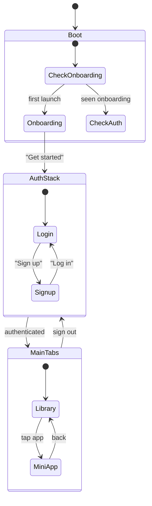

# Navigation

**Stack:** React Navigation v7 (native stack + bottom tabs)

## Screen Map



## Stack Structure

### Root Stack (`App.tsx`)

| Screen | Component | When |
|--------|-----------|------|
| Onboarding | `OnboardingScreen` | First launch only |
| Auth | `AuthStack` | Not logged in |
| MainTabs | Tab Navigator | Logged in |
| MiniApp | `MiniAppScreen` | Viewing a mini-app |

### Auth Stack (`navigation/AuthStack.tsx`)

| Screen | Component |
|--------|-----------|
| Login | `LoginScreen` |
| Signup | `SignupScreen` |

### Main Tabs (Bottom Tab Navigator)

| Tab | Screen | Icon | Description |
|-----|--------|------|-------------|
| Library | `HomeScreen` | Grid | Saved mini-apps |
| Create | `CreateScreen` | Plus (center) | New app prompt |
| Profile | `ProfileScreen` | User | Account & stats |

## Type Definitions

**File:** `app/src/types/navigation.ts`

```typescript
type RootStackParamList = {
  Onboarding: undefined;
  Auth: undefined;
  MainTabs: undefined;
  MiniApp: { appId: string; title?: string };
};

type AuthStackParamList = {
  Login: undefined;
  Signup: undefined;
};

type TabParamList = {
  Library: undefined;
  Create: undefined;
  Profile: undefined;
};
```

## Screen Details

### HomeScreen (Library)
- Grid layout of `MiniAppCard` components
- Search bar for filtering
- Long-press for delete
- "Edit" button for modification
- Pull-to-refresh

### CreateScreen
- Text input for prompt
- "Clarify" step → shows questions
- "Generate" button → background generation
- Progress indicator via `GenerationContext`

### MiniAppScreen
- Receives `appId` via route params
- Loads spec from storage
- Renders via `MiniAppRenderer`
- Header shows app name
