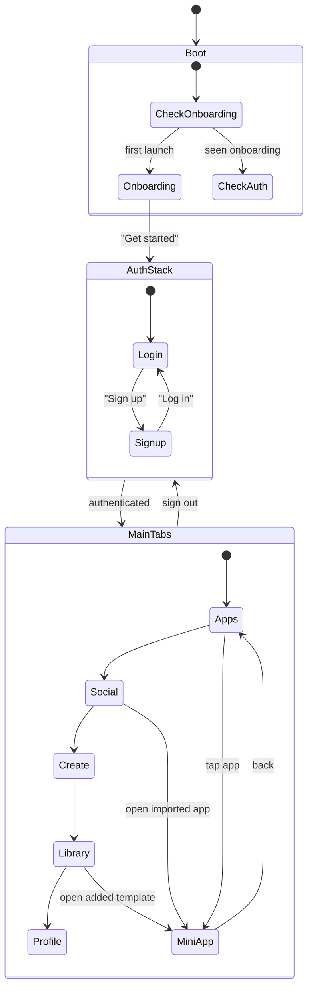

# Navigation

**Stack:** React Navigation v7 (native stack + bottom tabs)

## Screen Map



## Stack Structure

### Root Stack (`App.tsx`)

| Screen | Component | When |
|--------|-----------|------|
| Onboarding | `OnboardingScreen` | First launch only |
| Auth | `AuthStack` | Not logged in |
| MainTabs | Tab Navigator | Logged in |
| MiniApp | `MiniAppScreen` | Viewing a mini-app |
| Legal | `LegalScreen` | Privacy/Support page |

### Auth Stack (`navigation/AuthStack.tsx`)

| Screen | Component |
|--------|-----------|
| Login | `LoginScreen` |
| Signup | `SignupScreen` |

### Main Tabs (Bottom Tab Navigator)

| Tab | Screen | Icon | Description |
|-----|--------|------|-------------|
| My Apps (`Apps`) | `HomeScreen` | Grid | Saved mini-apps + sharing |
| Social | `SocialScreen` | People | Friend avatars + import from share code/QR |
| Create | `CreateScreen` | Plus (center) | New app prompt |
| Official (`Library`) | `DeveloperLibraryScreen` | Library | Curated templates (add/ignore/open) |
| Profile | `ProfileScreen` | User | Account & stats |

## Type Definitions

**File:** `app/src/types/navigation.ts`

```typescript
type RootStackParamList = {
  Onboarding: undefined;
  Auth: undefined;
  MainTabs: undefined;
  MiniApp: { appId: string };
  Legal: { section: "privacy" | "support" };
};

type AuthStackParamList = {
  Login: undefined;
  Signup: undefined;
};

type TabParamList = {
  Apps: undefined;
  Social: undefined;
  Create: undefined;
  Library: undefined;
  Profile: undefined;
};
```

## Screen Details

### HomeScreen (My Apps)
- Grid layout of `MiniAppCard` components
- Search bar for filtering
- Card menu for modify/report/delete/share
- Share opens short code + QR export modal
- Pull-to-refresh

### SocialScreen
- Friends strip (avatars)
- Shared-with-you app feed
- Import modal with:
  - short code format (`abc-def-ghi`)
  - QR scan support
  - quick action to open imported app

### DeveloperLibraryScreen (Official)
- Shows featured templates from backend
- Supports add / ignore status
- Added templates open directly after install

### CreateScreen
- Text input for prompt
- "Clarify" step → shows questions
- "Generate" button → background generation
- Progress indicator via `GenerationContext`

### MiniAppScreen
- Receives `appId` via route params
- Loads spec from storage
- Renders via `MiniAppRenderer`
- Header shows app name
