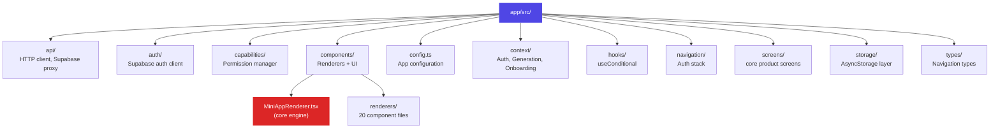
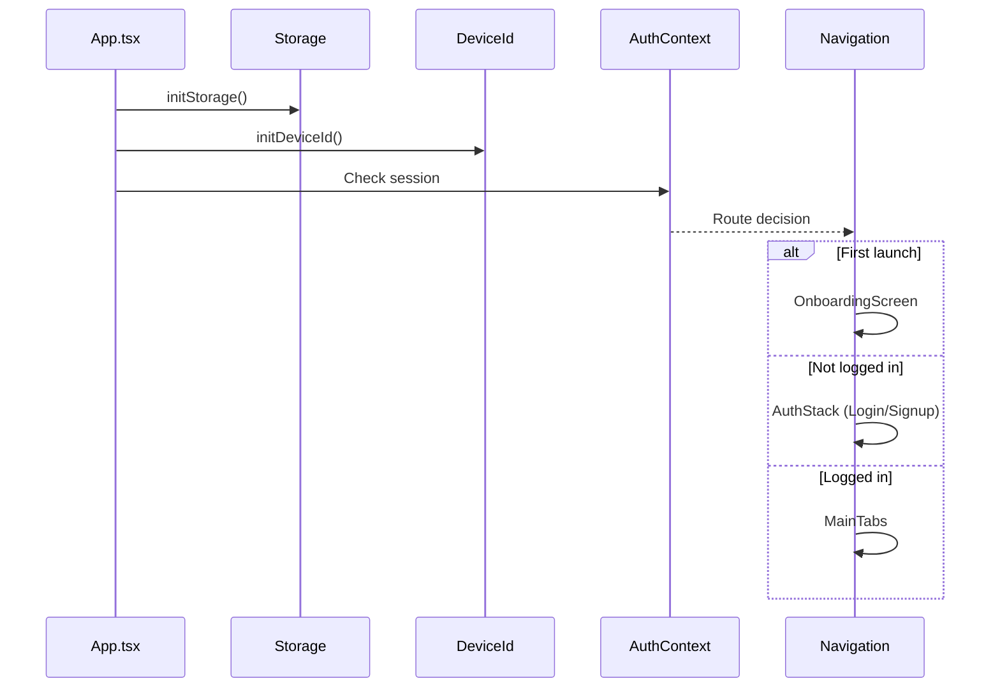

# App Package

**Location:** `app/src/`
**Stack:** React Native, Expo 54, React Navigation v7, TypeScript

The app is a generic mini-app player. It loads JSON specs from storage, renders interactive UIs, manages per-app state, and syncs to the cloud.

## Product Screens

- `HomeScreen` (My Apps)
- `SocialScreen`
- `CreateScreen`
- `DeveloperLibraryScreen` (Official)
- `ProfileScreen`
- `LegalScreen`
- `MiniAppScreen`
- plus onboarding/auth screens

## Directory Structure



## Key Files

| File | Purpose |
|------|---------|
| `App.tsx` | Root: providers, navigation container, initialization |
| `config.ts` | Reads from `swissknife.config.js` via Expo extras |
| `components/MiniAppRenderer.tsx` | Core rendering engine (584 lines) |
| `storage/storageLayer.ts` | AsyncStorage + in-memory cache |
| `capabilities/capabilityManager.ts` | Native permission system |
| `context/GenerationContext.tsx` | Generation/modification orchestration |
| `context/AuthContext.tsx` | Supabase session management |
| `api/client.ts` | HTTP calls to server |
| `api/supabaseClient.ts` | Cloud storage proxy |

## Boot Sequence



## Contexts

### AuthContext
- Wraps the entire app
- Provides: `session`, `signIn()`, `signUp()`, `signOut()`
- Uses Supabase Auth (email + password)

### GenerationContext
- Available within MainTabs
- Provides: `startGenerate()`, `startModify()`, `busy`, `notification`
- Orchestrates the full generate/modify lifecycle:
  1. Call server API
  2. Request capabilities
  3. Save to storage
  4. Show notification toast

### OnboardingContext
- One-time onboarding flow
- Tracks `hasSeenOnboarding` in AsyncStorage

## Configuration

```typescript
// app/src/config.ts
{
  apiBaseUrl: "http://192.168.x.x:3001",  // Server URL (LAN IP for devices)
  supabaseUrl: "https://xxx.supabase.co",
  supabaseAnonKey: "eyJ...",
  debug: true
}
```

Read from `swissknife.config.js` → `app.config.js` → Expo `extra` → `config.ts`.
