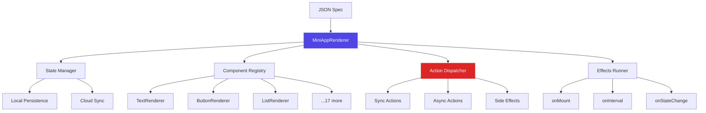
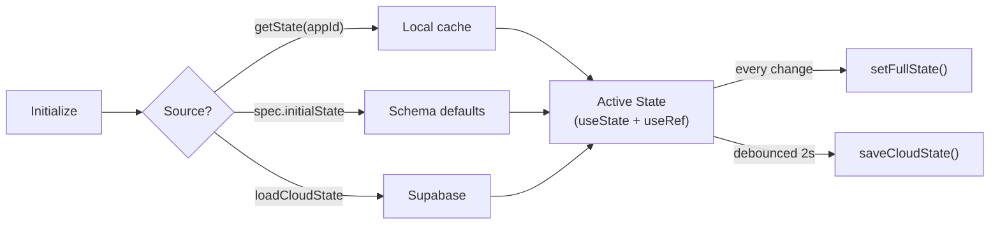
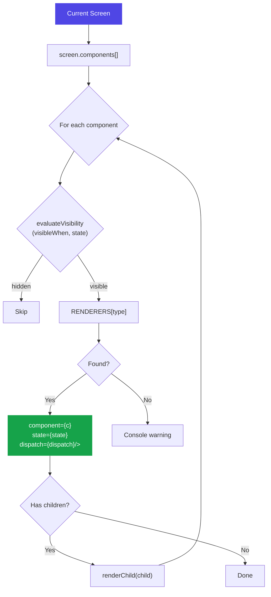

# MiniAppRenderer

**File:** `app/src/components/MiniAppRenderer.tsx` (584 lines)

The renderer is the heart of SwissKnife. It interprets a JSON spec and produces a fully interactive React Native UI.

## Architecture



## Component Registry

The `RENDERERS` map binds component type strings to React components:

```typescript
const RENDERERS: Record<string, React.FC<RendererProps>> = {
  text:          TextRenderer,
  button:        ButtonRenderer,
  input:         InputRenderer,
  list:          ListRenderer,
  image:         ImageRenderer,
  card:          CardRenderer,
  container:     ContainerRenderer,
  tabs:          TabsRenderer,
  modal:         ModalRenderer,
  divider:       DividerRenderer,
  spacer:        SpacerRenderer,
  slider:        SliderRenderer,
  toggle:        ToggleRenderer,
  select:        SelectRenderer,
  progress:      ProgressRenderer,
  cameraView:    CameraViewRenderer,
  audioRecorder: AudioRecorderRenderer,
  datePicker:    DatePickerRenderer,
  chart:         ChartRenderer,
  mapView:       MapViewRenderer,
};
```

Each renderer receives `RendererProps`:

| Prop | Type | Description |
|------|------|-------------|
| `component` | Component | The component definition from the spec |
| `state` | Record | Current app state |
| `dispatch` | Function | Action dispatcher |
| `onNavigate` | Function | Screen navigation callback |
| `renderChild` | Function | Recursively render nested components |

## State Management



**Key implementation detail:** The `dispatch` function uses `stateRef.current` instead of the state variable directly. This avoids stale closure problems since `dispatch` is memoized with `useCallback([spec.appId])`.

## Action Dispatch

The `dispatch` function is a large switch statement handling all 13 action types:

### Sync Actions
Processed immediately, update state in a single `setState` call:

- **`setState`** — Direct key-value assignment
- **`append`** — Push to array
- **`remove`** — Splice from array by index
- **`compute`** — Math/string operations (increment, concat, now, etc.)

### Async Actions
Fire network requests, then update state on completion:

- **`http`** — Fetch URL, set `resultKey`/`loadingKey`/`errorKey`
- **`serverCall`** — Call per-app endpoint via `callServerEndpoint()`

### Side Effects
Trigger native APIs without state changes:

- **`navigate`** — Change `screenId`
- **`haptic`** — Device vibration
- **`copyToClipboard`** — System clipboard
- **`timer`** — Start/stop/reset interval (stored in `timersRef`)

### Control Flow
Meta-actions that dispatch other actions:

- **`conditional`** — Evaluate condition, dispatch `then` or `else`
- **`batch`** — Collect sync actions → single setState → then dispatch async

## Rendering Pipeline



## Effects System

Effects run automatically based on lifecycle events:

```typescript
// onMount — runs once
useEffect(() => {
  if (effects?.onMount) dispatch(effects.onMount);
}, [screenId]);

// onInterval — repeating timer
useEffect(() => {
  if (effects?.onInterval) {
    const id = setInterval(
      () => dispatch(effects.onInterval.action),
      effects.onInterval.intervalMs
    );
    return () => clearInterval(id);
  }
}, [screenId]);

// onStateChange — watch specific key
useEffect(() => {
  if (effects?.onStateChange && state[key] !== lastValue) {
    dispatch(effects.onStateChange.action);
  }
}, [state[watchedKey]]);
```

## Theme Support

The renderer applies theme colors from the spec:

```json
{
  "theme": {
    "primaryColor": "#4f46e5",
    "backgroundColor": "#111118",
    "textColor": "#ffffff",
    "accentColor": "#818cf8"
  }
}
```

The `ThemeProvider` wraps the mini-app and exposes colors via React context.
