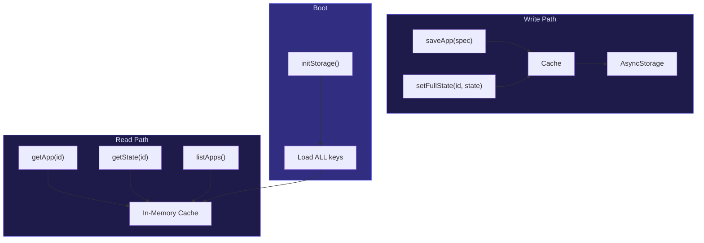
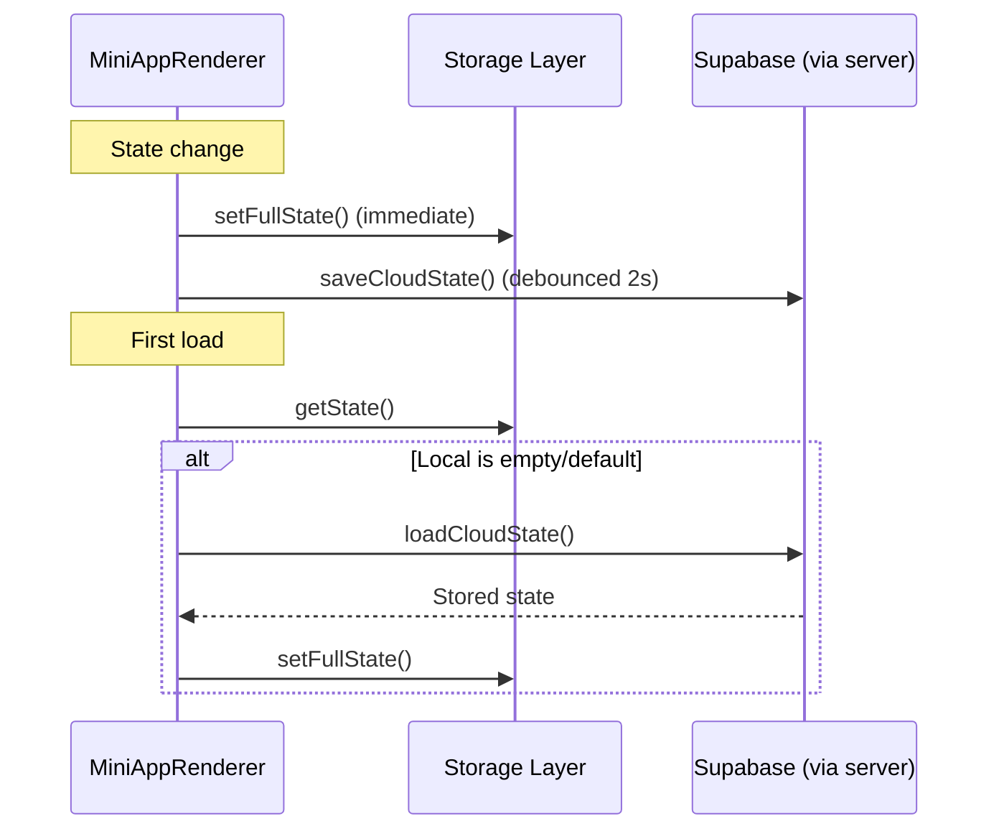

# Storage Layer

**File:** `app/src/storage/storageLayer.ts`

The storage layer provides fast, synchronous read access through an in-memory cache backed by AsyncStorage for persistence.

## Architecture



## Key Patterns

### Namespaced Keys

All storage keys follow a consistent naming pattern:

| Key Pattern | Content |
|-------------|---------|
| `app:{appId}:spec` | Mini-app JSON spec |
| `app:{appId}:state` | Current app state (key-value object) |
| `apps:index` | Array of all saved app IDs |

### Cache-First Access

- All reads go to the in-memory cache (synchronous, zero latency)
- All writes update cache first, then persist to AsyncStorage
- `initStorage()` must complete before any read — loads all keys at boot

### API

```typescript
// Initialization (must be called at boot)
initStorage(): Promise<void>

// App lifecycle
saveApp(spec: MiniApp): Promise<void>     // Save spec + add to index
getApp(appId: string): MiniApp | null      // Read spec from cache
listApps(): MiniApp[]                       // All saved apps
deleteApp(appId: string): Promise<void>    // Remove spec, state, and index entry

// State management
getState(appId: string): Record<string, any>
setState(appId: string, key: string, value: any): Promise<void>
setFullState(appId: string, state: Record): Promise<void>
clearState(appId: string): Promise<void>
```

## Cloud Sync

**File:** `app/src/api/supabaseClient.ts`

Cloud sync runs alongside local storage for cross-device availability:



**Identity:** Requests include either:
- `Authorization: Bearer <jwt>` + `x-user-id` (logged in)
- `x-device-id` (anonymous, UUID stored locally)
