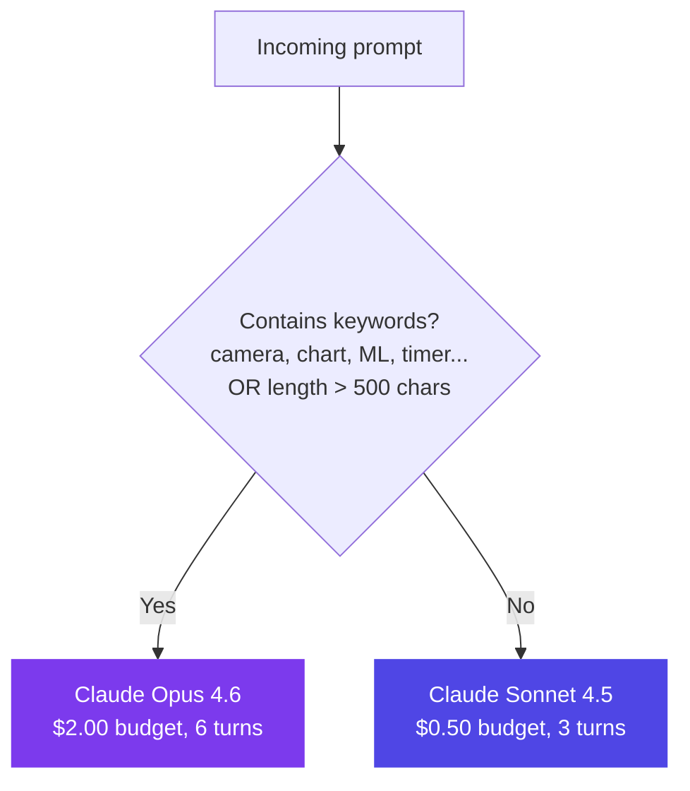
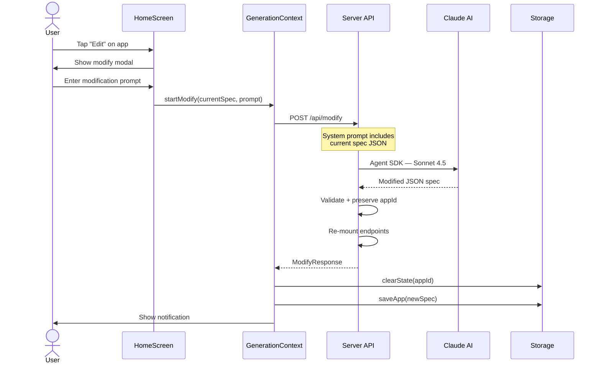
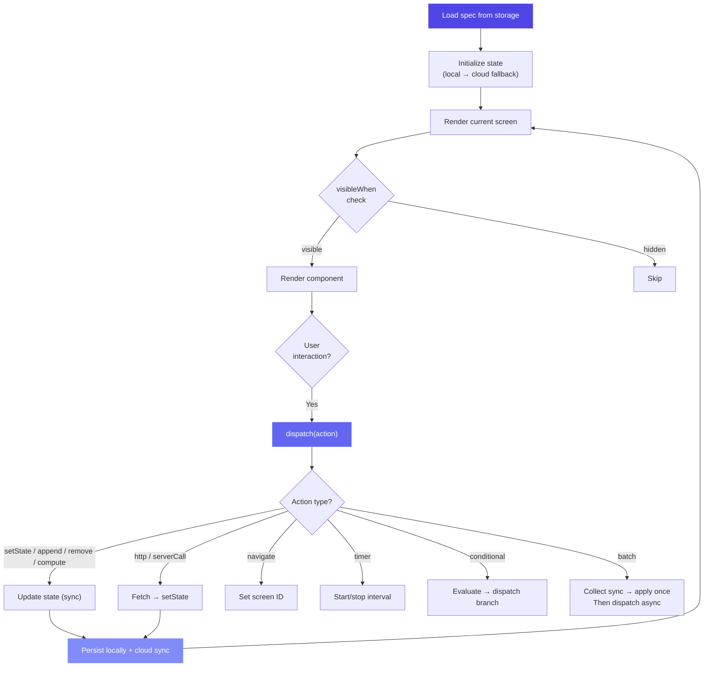
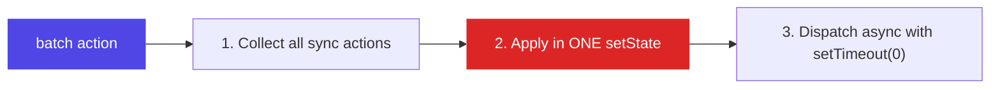
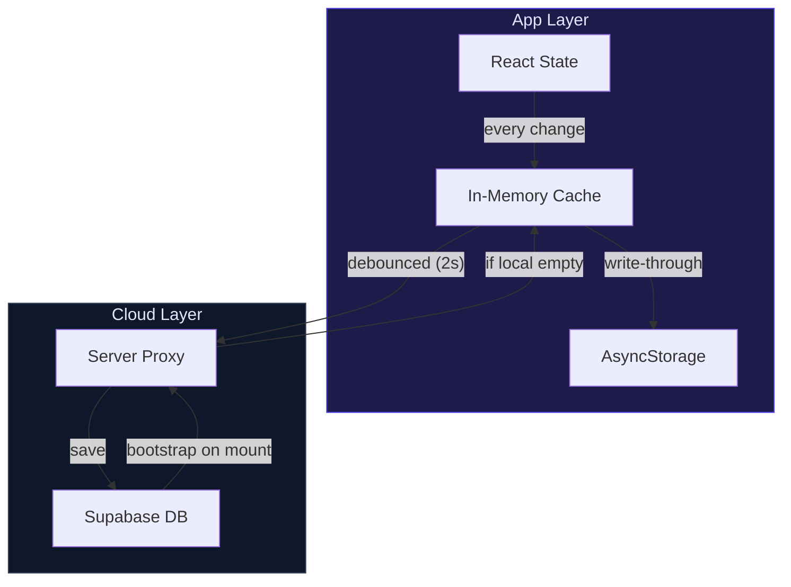
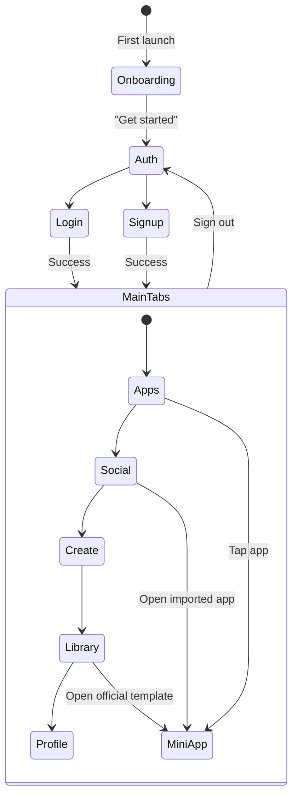
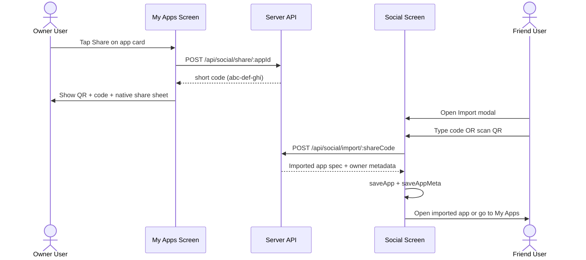
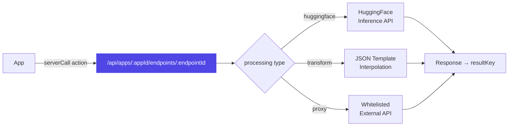

# Data Flow

This page documents the complete data flow for every major operation in SwissKnife.

## Create Flow

The journey from user prompt to rendered mini-app:

```mermaid
sequenceDiagram
    actor User
    participant Create as CreateScreen
    participant Gen as GenerationContext
    participant API as Server API
    participant Claude as Claude AI
    participant Val as Validator
    participant Store as Storage

    User->>Create: Enter prompt
    Create->>API: POST /api/clarify
    API->>Claude: Haiku — generate questions
    Claude-->>API: 3 questions + summary
    API-->>Create: ClarifyResponse
    Create->>User: Show questions
    User->>Create: Answer questions

    Create->>Gen: startGenerate(prompt, answers)
    Gen->>API: POST /api/generate
    API->>Claude: Agent SDK — Sonnet/Opus
    Claude-->>API: JSON spec
    API->>Val: validateMiniApp(spec)
    Val-->>API: Validated MiniApp

    API->>API: Mount server endpoints
    API-->>Gen: GenerateResponse

    Gen->>Store: saveApp(spec)
    Gen->>Gen: requestAllCapabilities()
    Gen->>User: Show notification
    User->>User: Tap → Navigate to MiniApp
```

### Model Selection

The server picks the Claude model based on prompt complexity:



## Modify Flow

Editing an existing mini-app:



## Runtime Flow

How a mini-app executes after loading:



### Batch Action Strategy

The renderer has a critical optimization for `batch` actions to prevent state race conditions:



## Storage Flow

Dual-layer persistence strategy:



**Storage keys:**
- `app:{appId}:spec` — The mini-app JSON spec
- `app:{appId}:state` — Current app state
- `apps:index` — List of all saved app IDs

## Auth Flow



**Identity resolution:**
- Logged in → JWT `sub` claim (verified with `SUPABASE_JWT_SECRET`)
- Anonymous → `x-device-id` header (UUID stored on device)

## Share & Import Flow



## Server Endpoints Flow

Per-app server endpoints for ML, transforms, and proxied APIs:



**Whitelisted proxy domains:** HuggingFace, OpenWeatherMap, JSONPlaceholder, PokeAPI, GitHub API.
