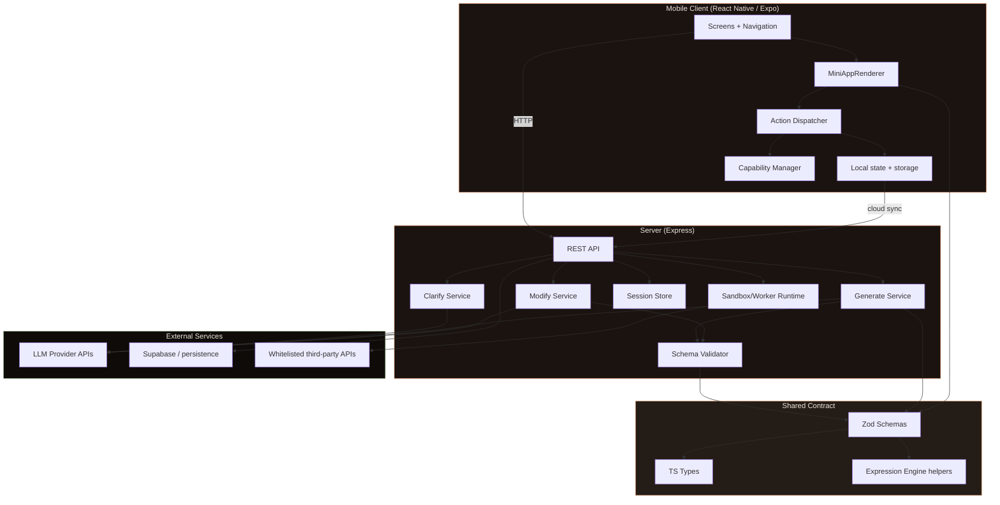
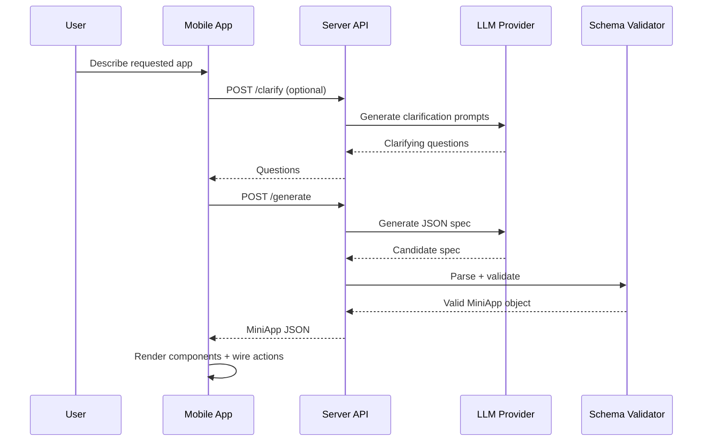
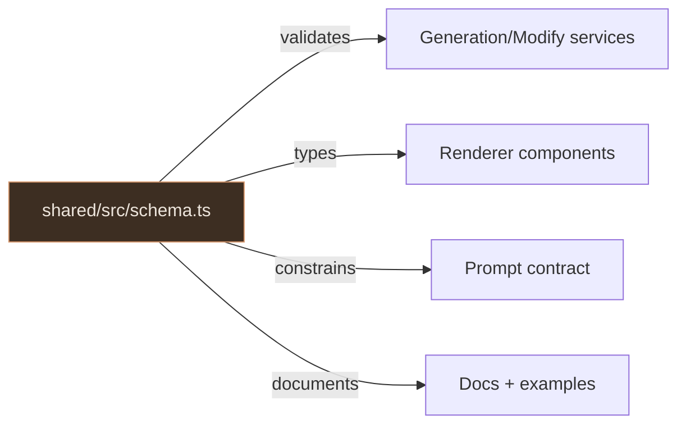

# Architecture Overview

Baristapp is a schema-first mini-app platform: the same contract drives generation, validation, storage, and rendering.

## System Architecture

## Request lifecycle

## Package boundaries

| Package | Responsibility | Must not do |
|---|---|---|
| `shared` | Schema/types contract | Call network or platform APIs |
| `server` | Generate/modify/validate and persistence | Trust unvalidated model output |
| `app` | Render validated specs and dispatch actions | Execute arbitrary generated code |
| `docs` | Product and engineering documentation | Drift from actual implementation |
| `website` | Marketing site and entry points | Act as source of technical truth |

## Schema as Contract

The contract in `shared/src/schema.ts` is the primary interface between AI and runtime.

## Extension model

When adding a new component or action:

1. Extend `shared` schema and TS types first.
2. Add renderer/dispatcher implementation in `app`.
3. Update generation prompts and validation expectations in `server`.
4. Add docs and examples for usage and safety implications.

This flow prevents partial rollouts and keeps the system deterministic.

## Production readiness notes

- Enforce strict schema validation for every generation and modification request.
- Keep endpoint and capability whitelists explicit and reviewed.
- Use environment-specific secrets and isolated Supabase projects.
- Maintain docs as release artifacts, not afterthoughts.
