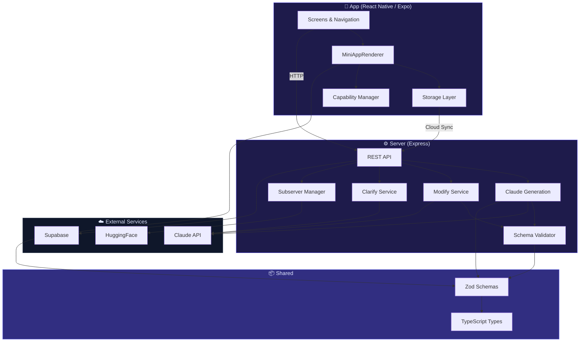
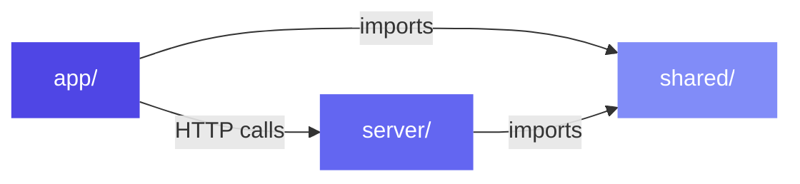
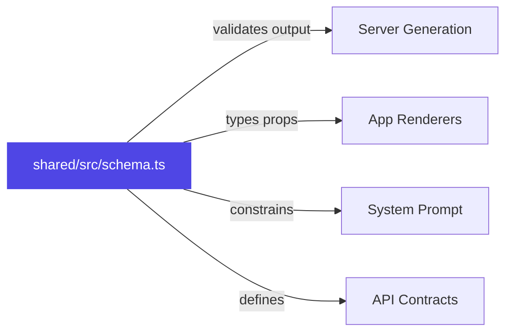

# Architecture Overview

SwissKnife is a three-package monorepo where a **shared schema** connects an **Express server** (AI generation) to a **React Native app** (rendering engine).

## System Architecture

## Package Dependencies

- **shared** has zero internal dependencies — it's pure Zod schemas and types
- **server** imports shared for validation and type checking
- **app** imports shared for types; communicates with server via HTTP

## Schema as Contract

The core design principle: **the Zod schema is the single source of truth**.

When Claude generates a mini-app spec, the server validates it against the Zod schema. The app renders only components and actions defined in that same schema. This means:

1. **Claude can't invent new component types** — they'd fail validation
2. **The app can't receive unknown shapes** — TypeScript enforces the schema
3. **Adding a new feature** requires updating the schema first, then server + app

## Schema Versions

| Version | Components | Actions | Features |
|---------|-----------|---------|----------|
| **v1** | 5 basic | 4 basic | Screens, simple state |
| **v2** | 20 total | 13 total | Theme, effects, server endpoints, capabilities |

The unified `MiniAppSchema` is a union of both versions for backward compatibility.

## Tech Stack

| Layer | Technology | Purpose |
|-------|-----------|---------|
| Mobile | React Native + Expo 54 | Cross-platform renderer |
| Navigation | React Navigation v7 | Screen routing |
| State | React useState + refs | Per-app state management |
| Local Storage | AsyncStorage | Persistent key-value store |
| Server | Express.js | REST API + middleware |
| AI | Claude API (Sonnet/Opus) | Spec generation & modification |
| Cloud | Supabase | Auth, database, storage |
| Schema | Zod | Runtime validation |
| Types | TypeScript | Static analysis |
