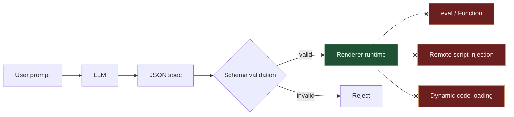
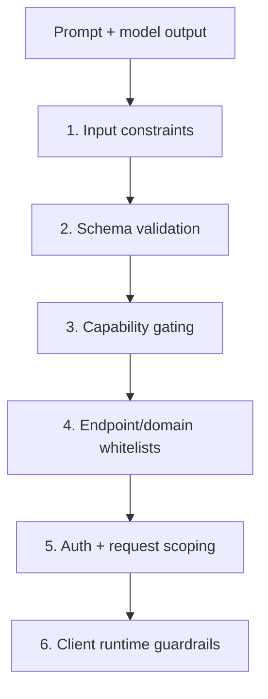
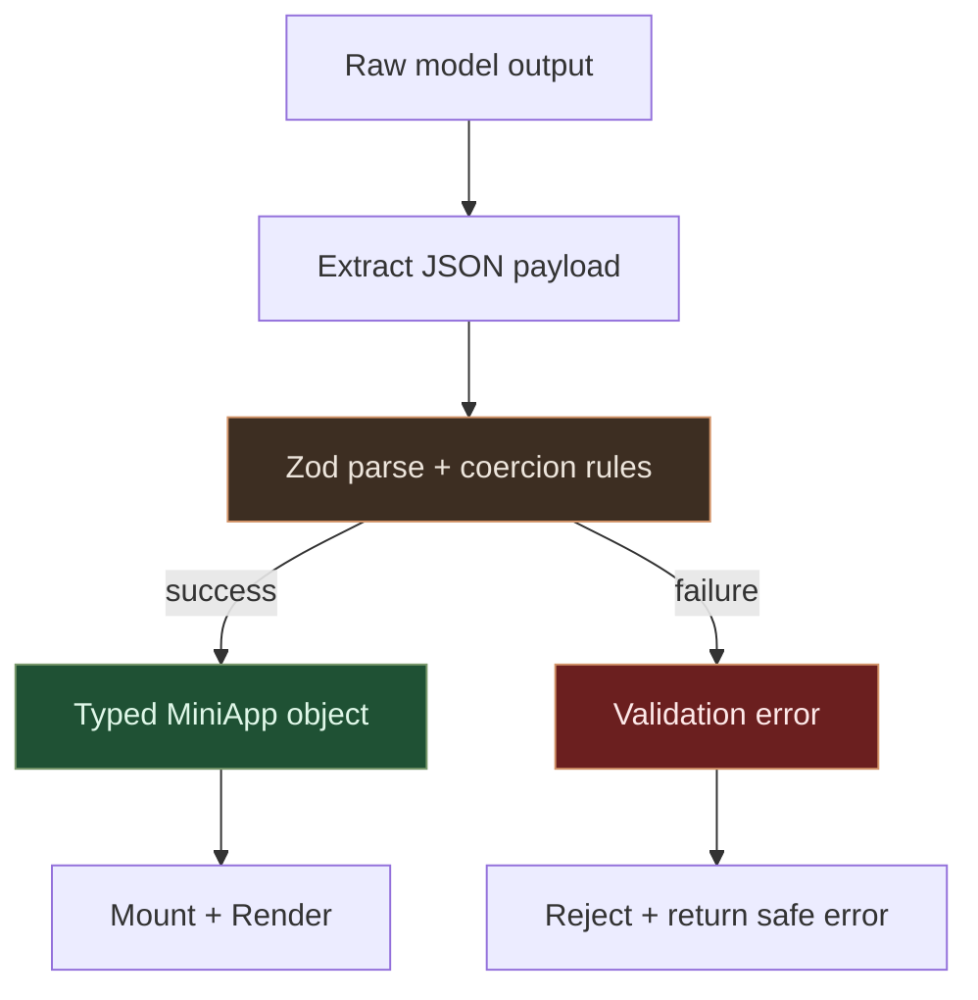
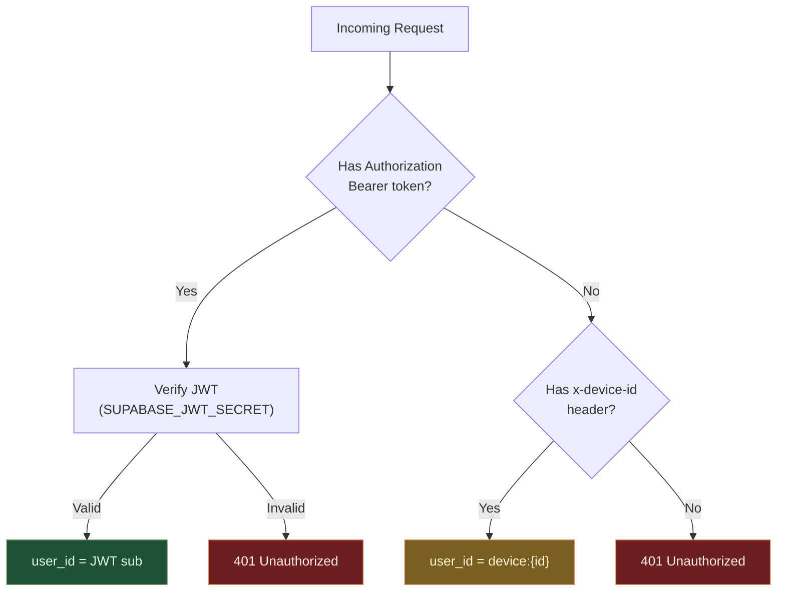
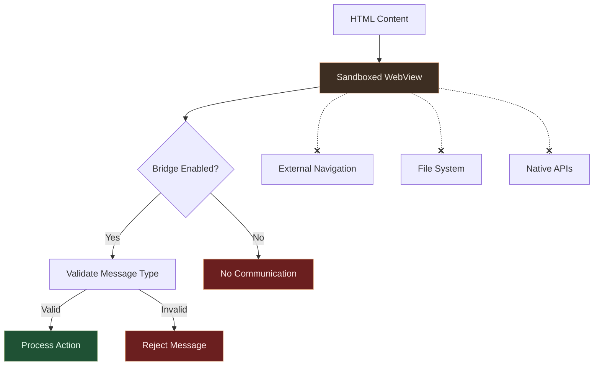

# Security Model

Baristapp is designed to reduce risk by construction: model output is treated as untrusted data and never executed as code.

## Threat model in one sentence

User prompts and LLM output may be malicious or malformed, so every step assumes adversarial input and enforces strict validation before runtime use.

## Core principle: declarative, not executable

The runtime is a generic renderer that interprets JSON. It has no mechanism to execute arbitrary generated code:

- No `eval()` or `Function()` constructor
- No `<script>` tags or remote script loading
- No dynamic `import()` or `require()`
- No direct HTML injection in native UI rendering paths

## Security control layers

## Validation pipeline

Every generated or modified spec must parse cleanly against shared Zod schemas:

### What this blocks

- Unknown component/action types.
- Invalid prop shapes and malformed action payloads.
- Illegal enum/operator/capability values.
- Cross-version spec drift.

## Capability System

Capabilities are explicit and minimal. Apps request what they need, and user/device permissions are still enforced by native platforms.

| Capability | Permission Required | Auto-granted |
|-----------|-------------------|-------------|
| `localStorage` | No | Yes |
| `haptics` | No | Yes |
| `clipboard` | No | Yes |
| `camera` | Native dialog | No |
| `microphone` | Native dialog | No |
| `location` | Native dialog | No |
| `network` | No | Yes |
| `notifications` | Native dialog | No |
| `supabaseStorage` | No | Yes |

## Network and endpoint safety

Server-side proxying is restricted to approved domains. Endpoint execution is scoped and validated.

- Requests to non-whitelisted domains are denied.
- Per-app endpoints are namespaced to avoid cross-app access.
- Sensitive headers/secrets are not exposed to client-generated specs.

## Auth & Identity

## Per-App Isolation

- Each mini-app has a unique `appId`
- Storage is namespaced: `app:{appId}:state`
- Server endpoints are scoped: `/api/apps/{appId}/endpoints/{endpointId}`
- Apps cannot access each other's state or endpoints

## WebView and embedded content

When WebView-style components are used, content must stay sandboxed with strict navigation and bridge validation.

### Sandbox controls

**Navigation restrictions**
- All external URLs are blocked (`onShouldStartLoadWithRequest` returns `false`)
- Only inline HTML (`data:` URIs) and `about:blank` are allowed
- No redirects to external domains

**File access**
- `allowFileAccess={false}` — No local file system access
- `allowFileAccessFromFileURLs={false}` — No file:// URL access
- `allowUniversalAccessFromFileURLs={false}` — No cross-origin file access

**Bridge API**
- Only whitelisted message types: `setState`, `dispatch`, `message`, `bridgeReady`
- All bridge messages are validated before processing
- State updates are limited to declared `stateKeys` (if provided)
- Actions dispatched from WebView must match the schema (validated by renderer)

## Security operations checklist

- Enforce schema validation on all generation/modify endpoints.
- Keep capability and domain whitelists reviewed and versioned.
- Rotate secrets and isolate environments (dev/staging/prod).
- Log rejects/validation failures for anomaly detection.
- Run dependency and container/runtime scans before each release.
