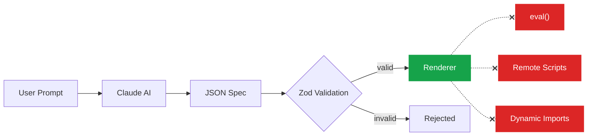
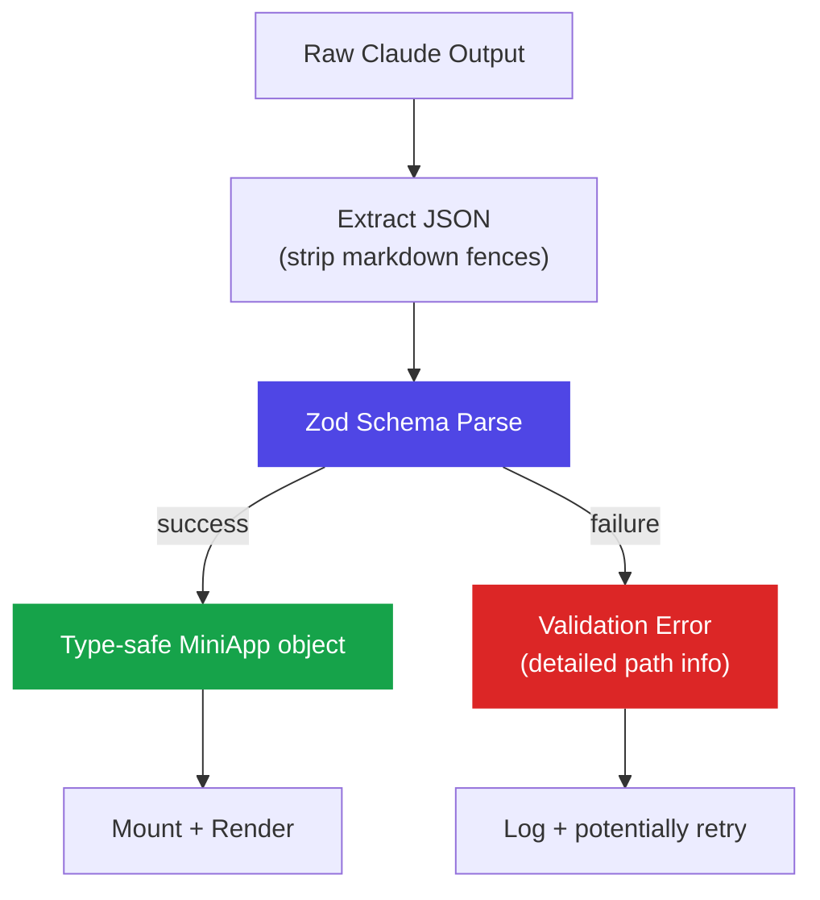
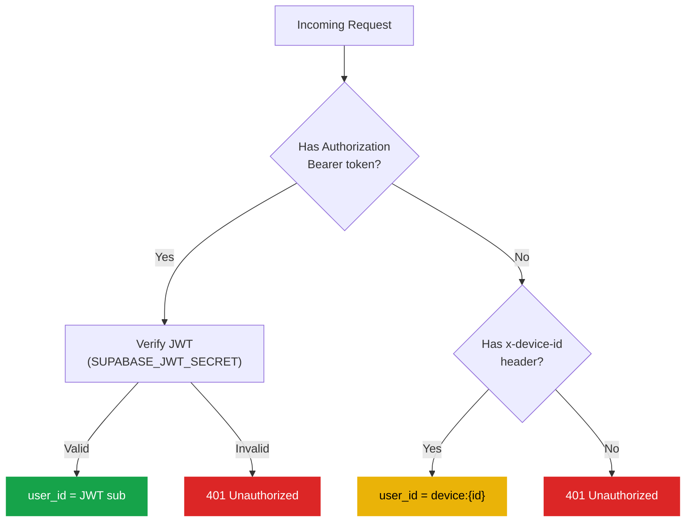
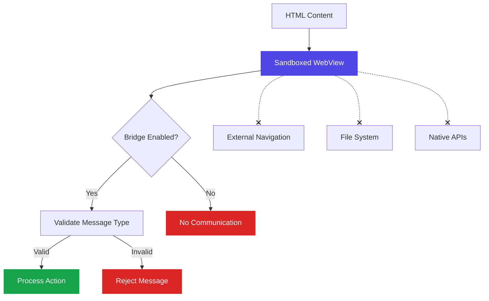

# Security Model

SwissKnife is designed with security as a first-class concern. The declarative architecture eliminates entire categories of vulnerabilities.

## Core Principle: No Code Execution



The app is a **generic renderer** — it interprets a JSON schema. There is no mechanism to execute arbitrary code:

- No `eval()` or `Function()` constructor
- No `<script>` tags or remote script loading
- No dynamic `import()` or `require()`
- No `dangerouslySetInnerHTML` or equivalent

## Validation Pipeline

Every generated spec passes through strict validation before rendering:



The Zod schema enforces:
- Only known component types (20 defined)
- Only known action types (13 defined)
- Correct property shapes for each type
- Valid enum values for variants, operators, etc.

## Capability System

Apps must declare the native capabilities they need. The user grants permissions explicitly:

| Capability | Permission Required | Auto-granted |
|-----------|-------------------|-------------|
| `localStorage` | No | Yes |
| `haptics` | No | Yes |
| `clipboard` | No | Yes |
| `camera` | Native dialog | No |
| `microphone` | Native dialog | No |
| `location` | Native dialog | No |
| `network` | No | Yes |
| `notifications` | Native dialog | No |
| `supabaseStorage` | No | Yes |

## Proxy Whitelist

The `proxy` endpoint handler only forwards requests to pre-approved domains:

```
api-inference.huggingface.co
api.openweathermap.org
jsonplaceholder.typicode.com
pokeapi.co
api.github.com
```

Any attempt to proxy to an unlisted domain is rejected.

## Auth & Identity



## Per-App Isolation

- Each mini-app has a unique `appId`
- Storage is namespaced: `app:{appId}:state`
- Server endpoints are scoped: `/api/apps/{appId}/endpoints/{endpointId}`
- Apps cannot access each other's state or endpoints

## WebView Security

The `webView` component renders HTML/CSS/JavaScript in a sandboxed WebView (WKWebView on iOS, WebView on Android). Security is enforced at multiple layers:

### Sandbox Constraints



**Navigation Restrictions:**
- All external URLs are blocked (`onShouldStartLoadWithRequest` returns `false`)
- Only inline HTML (`data:` URIs) and `about:blank` are allowed
- No redirects to external domains

**File Access:**
- `allowFileAccess={false}` — No local file system access
- `allowFileAccessFromFileURLs={false}` — No file:// URL access
- `allowUniversalAccessFromFileURLs={false}` — No cross-origin file access

**Bridge API:**
- Only whitelisted message types: `setState`, `dispatch`, `message`, `bridgeReady`
- All bridge messages are validated before processing
- State updates are limited to declared `stateKeys` (if provided)
- Actions dispatched from WebView must match the schema (validated by renderer)

**Apple Guideline 4.7 Compliance:**
The WebView implementation follows Apple's guidelines for HTML5 mini-apps:
- Content is generated dynamically (not pre-packaged HTML files)
- No access to native device features from WebView JavaScript
- All native interactions go through the validated bridge API
- WebView content cannot access camera, location, contacts, etc. directly
