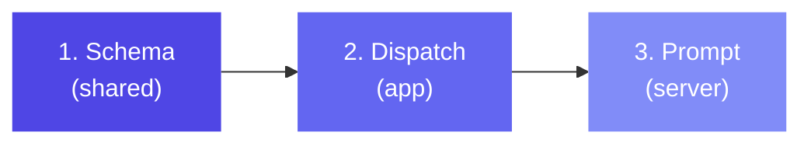

# Adding a New Action

This guide explains how to add a new action type. Actions require changes to 3 files.

## Overview



## Step 1: Define the Schema

**File:** `shared/src/schema.ts`

```typescript
const ShareAction = z.object({
  type: z.literal("share"),
  text: z.string().optional(),
  url: z.string().optional(),
  stateKey: z.string().optional(),  // Dynamic content from state
});
```

Add to the `Action` union:

```typescript
const Action = z.discriminatedUnion("type", [
  NavigateAction,
  SetStateAction,
  // ... existing actions ...
  ShareAction,  // Add here
]);
```

## Step 2: Handle in Dispatch

**File:** `app/src/components/MiniAppRenderer.tsx`

Add a case in the `dispatch` function:

```typescript
const dispatch = useCallback(async (action: any) => {
  const s = stateRef.current;

  switch (action.type) {
    // ... existing cases ...

    case "share": {
      const text = resolveTemplate(action.text, s);
      const url = resolveTemplate(action.url, s);
      try {
        await Share.share({
          message: text,
          url: url,
        });
      } catch (e) {
        console.warn("Share failed:", e);
      }
      break;
    }
  }
}, [spec.appId]);
```

## Step 3: Document in the System Prompt

**File:** `server/src/prompts/masterPrompt.ts`

```
## share
Share content via the system share sheet.
Properties:
- text (string, optional): Text to share (supports {{stateKey}})
- url (string, optional): URL to share (supports {{stateKey}})
```

## Action Categories

When implementing, consider which category your action falls into:

| Category | Behavior | Examples |
|----------|----------|---------|
| **Sync** | Updates state immediately | `setState`, `append`, `remove`, `compute` |
| **Async** | Fires a request, updates state on completion | `http`, `serverCall` |
| **Side Effect** | Calls native API, no state change | `haptic`, `copyToClipboard`, `share` |
| **Control Flow** | Dispatches other actions | `conditional`, `batch` |

:::warning Batch Compatibility
If your action is **sync** (modifies state directly), it must work with the batch optimization. Batch collects all sync actions and applies them in one `setState` call. Make sure your action's state changes can be collected as a partial state object.
:::

## Checklist

- [ ] Zod schema in `shared/src/schema.ts`
- [ ] Added to `Action` discriminated union
- [ ] Case in `dispatch` in `MiniAppRenderer.tsx`
- [ ] Documented in `masterPrompt.ts`
- [ ] TypeScript compiles (`npm run typecheck`)
