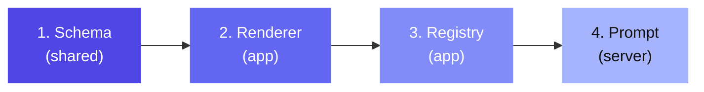

# Adding a New Component

This guide explains how to add a new component type to SwissKnife. Every new component touches 4 files across 3 packages.

## Overview



## Step 1: Define the Schema

**File:** `shared/src/schema.ts`

Add a new Zod schema for the component:

```typescript
const RatingComponent = z.object({
  type: z.literal("rating"),
  stateKey: z.string(),
  max: z.number().optional().default(5),
  label: z.string().optional(),
  visibleWhen: VisibleWhen.optional(),
});
```

Then add it to the `Component` union:

```typescript
const Component: z.ZodType = z.lazy(() =>
  z.discriminatedUnion("type", [
    TextComponent,
    ButtonComponent,
    // ... existing components ...
    RatingComponent,  // Add here
  ])
);
```

## Step 2: Create the Renderer

**File:** `app/src/components/renderers/RatingRenderer.tsx`

```tsx
import React from "react";
import { View, TouchableOpacity, Text } from "react-native";
import type { RendererProps } from "./types";

export const RatingRenderer: React.FC<RendererProps> = ({
  component,
  state,
  dispatch,
}) => {
  const { stateKey, max = 5, label } = component as any;
  const value = (state[stateKey] as number) || 0;

  return (
    <View>
      {label && <Text>{label}</Text>}
      <View style={{ flexDirection: "row" }}>
        {Array.from({ length: max }, (_, i) => (
          <TouchableOpacity
            key={i}
            onPress={() =>
              dispatch({ type: "setState", key: stateKey, value: i + 1 })
            }
          >
            <Text style={{ fontSize: 24 }}>
              {i < value ? "★" : "☆"}
            </Text>
          </TouchableOpacity>
        ))}
      </View>
    </View>
  );
};
```

## Step 3: Register in the Renderer

**File:** `app/src/components/MiniAppRenderer.tsx`

Add to the `RENDERERS` map:

```typescript
import { RatingRenderer } from "./renderers/RatingRenderer";

const RENDERERS: Record<string, React.FC<RendererProps>> = {
  // ... existing entries ...
  rating: RatingRenderer,
};
```

## Step 4: Document in the System Prompt

**File:** `server/src/prompts/masterPrompt.ts`

Add documentation so Claude knows how to use the component:

```typescript
## rating
Star rating input.
Properties:
- stateKey (string, required): State key for numeric rating value
- max (number, optional): Maximum stars (default: 5)
- label (string, optional): Label text
```

## Checklist

- [ ] Zod schema in `shared/src/schema.ts`
- [ ] Added to `Component` discriminated union
- [ ] Renderer file in `app/src/components/renderers/`
- [ ] Registered in `RENDERERS` map in `MiniAppRenderer.tsx`
- [ ] Documented in `masterPrompt.ts`
- [ ] TypeScript compiles (`npm run typecheck`)
