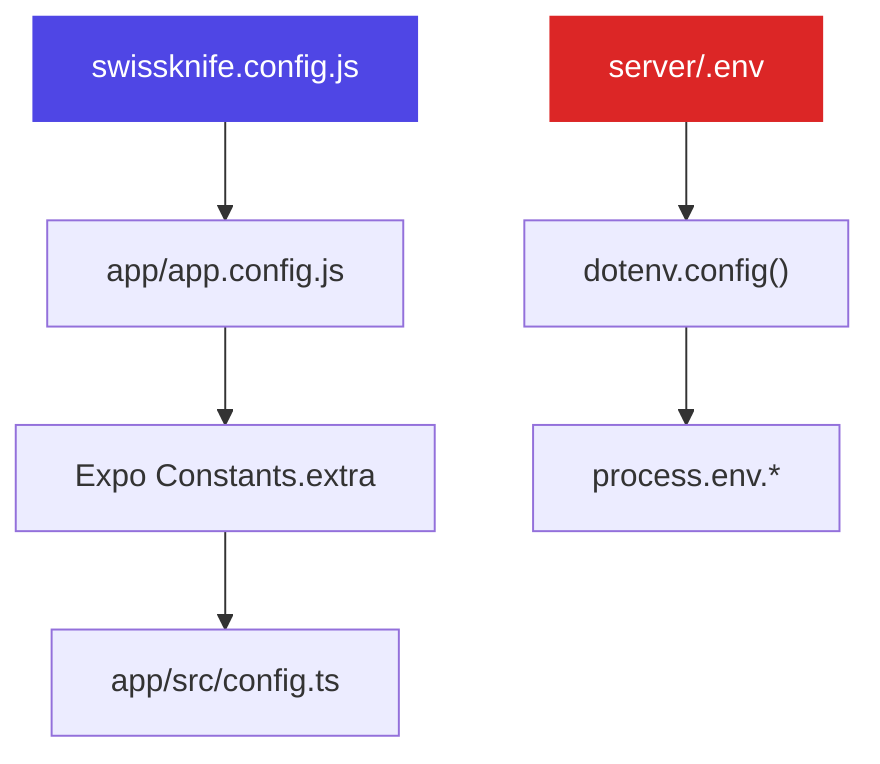

# Environment Variables

SwissKnife uses two configuration layers: `swissknife.config.js` for app/build-time config, and `.env` for server secrets.

## Server `.env`

**Location:** `server/.env`

| Variable | Required | Default | Description |
|----------|----------|---------|-------------|
| `ANTHROPIC_API_KEY` | **Yes** | — | Claude API key from [console.anthropic.com](https://console.anthropic.com) |
| `PORT` | No | `3001` | Server listen port |
| `HUGGINGFACE_API_KEY` | For ML | — | HuggingFace Inference API key |
| `SUPABASE_URL` | For storage | — | Supabase project URL |
| `SUPABASE_SERVICE_ROLE_KEY` | For storage | — | Supabase service role key (not the anon key) |
| `SUPABASE_JWT_SECRET` | For auth | — | JWT secret for verifying auth tokens |

:::danger Secret Management
Never commit `.env` to version control. The `.gitignore` should already exclude it. The `SUPABASE_SERVICE_ROLE_KEY` has full database access — treat it like a root password.
:::

## App Config

**Location:** `swissknife.config.js` (monorepo root)

```javascript
module.exports = {
  debug: true,                              // Enable debug logging
  apiBaseUrl: "http://192.168.2.223:3001",  // Server URL
  supabaseUrl: "https://xxx.supabase.co",   // Supabase project URL
  supabaseAnonKey: "eyJ...",                // Supabase anonymous key (safe to expose)
};
```

This file is read by:
1. `app/app.config.js` → injected into Expo `extra`
2. `app/src/config.ts` → reads from `Constants.expoConfig.extra`
3. Fallback: direct `require()` if Expo extras are empty

### LAN IP for Physical Devices

When testing on a physical device, `localhost` won't work. Use your machine's LAN IP:

```javascript
// swissknife.config.js
module.exports = {
  apiBaseUrl: "http://192.168.1.42:3001",  // Your LAN IP
  // ...
};
```

:::tip Config Changes Not Applying?
Clear the Expo cache: `npx expo start -c`
:::

## Configuration Flow



## Supabase Setup

To enable cloud sync, you need:

1. A Supabase project ([supabase.com](https://supabase.com))
2. Run `supabase_setup.sql` in the SQL Editor
3. Enable Email auth in Dashboard → Authentication → Providers
4. Copy credentials:
   - **Project URL** → `SUPABASE_URL` + `supabaseUrl`
   - **Service Role Key** → `SUPABASE_SERVICE_ROLE_KEY`
   - **Anon Key** → `supabaseAnonKey`
   - **JWT Secret** (Settings → API) → `SUPABASE_JWT_SECRET`
