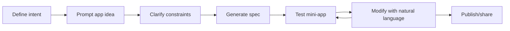

# How to Use Baristapp

This is the operator guide for daily usage: create apps fast, iterate safely, and ship with confidence.

## Workflow overview



## 1) Define intent before prompting

Write down three things before you ask the AI:

- **User:** who this app is for.
- **Outcome:** what the user should achieve in under 60 seconds.
- **Inputs/outputs:** data fields and expected results.

This improves generation quality and reduces rework.

## 2) Prompt with structure

Use this template:

```text
Build a [type of app] for [audience].
Must include: [features].
Data fields: [inputs].
Success criteria: [expected outputs/behaviors].
Design tone: [visual style].
```

## 3) Clarify aggressively

When clarification questions appear:

- Answer with concrete defaults (currencies, units, date format, limits).
- Specify validation and edge cases.
- Prefer deterministic rules over vague behavior.

## 4) Validate generated behavior

Run this quick acceptance pass:

- Navigation works and no dead-end screens.
- Core actions mutate state correctly.
- API actions handle loading/error states.
- Empty/error states are visible and understandable.
- Data persistence behavior matches your requirement.

## 5) Modify instead of regenerating

Prefer targeted edits:

- Good: "Add CSV export and keep all existing screens unchanged."
- Good: "Convert chart to stacked bars and preserve data model."
- Avoid: "Redo everything better."

Targeted modifications preserve stable features and reduce regressions.

## 6) Safety practices in prompt design

- Do not request hidden credentials or hardcoded secrets.
- Keep external API usage to approved/expected domains.
- Ask for explicit permissions only when needed (camera, mic, location).
- Require graceful fallback states for network failures.

## 7) Team workflow (recommended)

| Role | Responsibility |
|---|---|
| Product owner | Defines intent and acceptance criteria |
| App operator | Runs prompt/modify loops and triages issues |
| Reviewer | Checks safety, UX consistency, and release checklist |

## 8) Definition of done

A mini-app is ready when:

- All required user flows pass in manual testing.
- No schema validation/runtime errors are observed.
- Safety constraints are respected (capabilities, domains, auth).
- Documentation and screenshots are updated.
