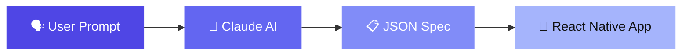

# SwissKnife

**AI-powered declarative micro-app engine** — describe what you need, get a fully interactive mobile app.



## What is SwissKnife?

SwissKnife is a secure, declarative micro-app container. Users describe a tool in natural language, and the system generates a full interactive React Native app — **without writing or executing any code**.

The pipeline:

1. **Clarify** — AI asks follow-up questions to refine the request
2. **Generate** — Claude produces a declarative JSON specification
3. **Validate** — Zod schemas enforce structural correctness
4. **Render** — The app interprets the spec as a live, interactive UI
5. **Modify** — Users request changes via natural language

:::info No Code Execution
The output is a **declarative schema** (screens, components, actions, state) — never executable code. No `eval()`, no remote scripts, no dynamic imports. The app is a generic renderer that interprets JSON.
:::

## Monorepo Structure

```
SwissKnife/
├── app/        → React Native (Expo) — the "player"
├── server/     → Express API — generation, storage, per-app endpoints
├── shared/     → Zod schemas + TypeScript types — single source of truth
└── docs/       → This documentation site
```

| Package | Stack | Role |
|---------|-------|------|
| **shared** | Zod, TypeScript | Schema definitions & API types |
| **server** | Express, Claude API, Supabase | AI generation, validation, storage |
| **app** | React Native, Expo, React Navigation | Renderer engine, state management |
| **docs** | Docusaurus | Documentation |

## Quick Start

```bash
# Install dependencies
npm install

# Start the server
npm run server

# Start the app (in another terminal)
npm run app

# Start the docs (in another terminal)
npm run docs
```

## Key Concepts

### Schema-First Design
Every component and action is defined in `shared/src/schema.ts`. The schema is the contract between AI generation and app rendering.

### Component Registry
The app has 20 built-in component types (text, button, input, list, chart, camera, etc.) registered in a renderer map. Claude generates specs using only these components.

### Declarative Actions
All interactivity is expressed as action objects — `setState`, `navigate`, `http`, `compute`, `timer`, etc. — dispatched by the renderer engine. **13 action types** cover everything from state updates to API calls.

### Dual Storage
Apps persist locally (AsyncStorage) for instant access and sync to the cloud (Supabase) for cross-device availability.
