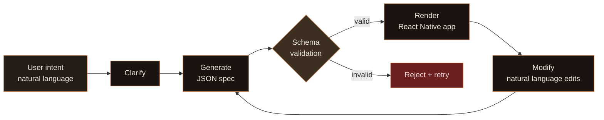

# Baristapp (SwissKnife monorepo)

Build production-grade mini apps from plain English prompts with a secure declarative engine.



## What this project is

Baristapp is a secure mini-app platform with a strict schema-driven runtime:

- Users describe an app in natural language.
- The server returns a declarative JSON spec.
- The mobile client renders it using whitelisted components and actions.
- No generated source code is executed in the client.

This repository name is `SwissKnife`, while the product/website branding is `Baristapp`.

## Why this architecture matters

- **Predictability:** every generated app must pass the same schema contract.
- **Safety:** no `eval`, no arbitrary runtime code, no dynamic imports.
- **Velocity:** new features are added by extending the schema + renderers, not by changing prompt hacks.
- **Auditability:** specs are plain JSON and can be versioned, diffed, and validated.

## Monorepo map

```text
SwissKnife/
├── app/       React Native renderer runtime (Expo)
├── server/    Express API + LLM orchestration + persistence
├── shared/    Zod schemas + TS contracts (single source of truth)
├── docs/      Docusaurus technical documentation
└── website/   Next.js marketing website
```

## Read this next

1. [Getting Started](./guides/getting-started.md) for local setup in under 15 minutes.
2. [How to Use](./guides/how-to-use.md) for day-to-day workflows (create, modify, debug).
3. [Architecture Overview](./architecture/overview.md) for system and data-flow diagrams.
4. [Security Model](./architecture/security.md) for threat model and controls.
5. [Release Checklist](./guides/release-checklist.md) before open-source/public launch.
