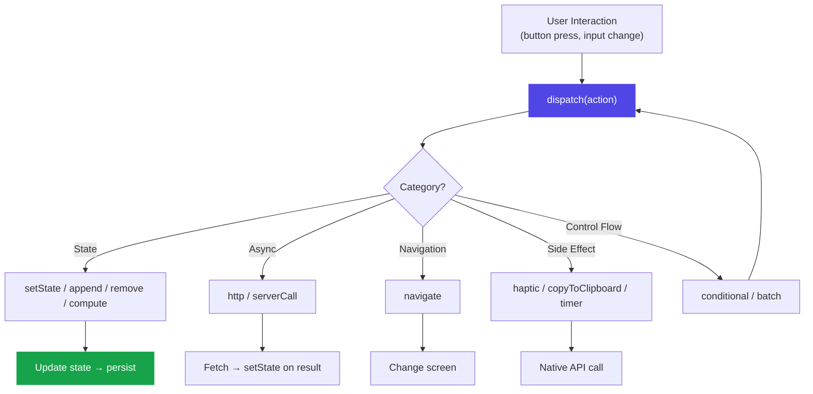

# Action Reference

Actions are declarative objects that describe what happens in response to user interactions. The renderer's `dispatch` function processes them. SwissKnife v2 supports **13 action types**.

## Action Flow



---

## State Actions

### `setState`

Set a single state key to a value.

```json
{
  "type": "setState",
  "key": "count",
  "value": 0
}
```

| Property | Type | Description |
|----------|------|-------------|
| `key` | string | State key to set |
| `value` | any | Value to assign (can use `"{{stateKey}}"` for dynamic values) |

### `append`

Add an item to an array in state.

```json
{
  "type": "append",
  "target": "todos",
  "value": { "text": "New item", "done": false }
}
```

| Property | Type | Description |
|----------|------|-------------|
| `target` | string | State key of the array |
| `value` | any | Item to append |

### `remove`

Remove an item from an array by index.

```json
{
  "type": "remove",
  "target": "todos",
  "index": 0
}
```

| Property | Type | Description |
|----------|------|-------------|
| `target` | string | State key of the array |
| `index` | number | Index to remove (supports `"{{stateKey}}"`) |

### `compute`

Perform math/string operations on state.

```json
{
  "type": "compute",
  "operation": "increment",
  "target": "count",
  "by": 1
}
```

**Operations:**

| Operation | Description | Properties |
|-----------|-------------|------------|
| `add` | Add two values | `a`, `b`, `target` |
| `subtract` | Subtract | `a`, `b`, `target` |
| `multiply` | Multiply | `a`, `b`, `target` |
| `divide` | Divide | `a`, `b`, `target` |
| `increment` | Add to existing | `target`, `by` |
| `decrement` | Subtract from existing | `target`, `by` |
| `concat` | Join strings | `a`, `b`, `target` |
| `now` | Current timestamp | `target` |
| `formatDate` | Format a date | `source`, `format`, `target` |
| `length` | Array/string length | `source`, `target` |
| `round` | Round number | `source`, `target`, `decimals` |

---

## Async Actions

### `http`

Make an HTTP request and store the result.

```json
{
  "type": "http",
  "url": "https://api.example.com/data",
  "method": "GET",
  "resultKey": "apiData",
  "loadingKey": "isLoading",
  "errorKey": "apiError"
}
```

| Property | Type | Description |
|----------|------|-------------|
| `url` | string | Request URL |
| `method` | `"GET"` \| `"POST"` \| `"PUT"` \| `"DELETE"` | HTTP method |
| `body` | object | Request body (POST/PUT) |
| `headers` | object | Request headers |
| `resultKey` | string | State key for response data |
| `loadingKey` | string | State key for loading boolean |
| `errorKey` | string | State key for error message |

### `serverCall`

Call an app-specific server endpoint.

```json
{
  "type": "serverCall",
  "endpointId": "classify-image",
  "body": { "image": "{{photo}}" },
  "resultKey": "classification",
  "loadingKey": "classifying",
  "errorKey": "classifyError"
}
```

| Property | Type | Description |
|----------|------|-------------|
| `endpointId` | string | ID matching a `serverEndpoints` entry |
| `body` | object | Data to send |
| `resultKey` | string | State key for result |
| `loadingKey` | string | Loading indicator key |
| `errorKey` | string | Error message key |

---

## Navigation

### `navigate`

Switch to a different screen.

```json
{
  "type": "navigate",
  "screen": "details"
}
```

| Property | Type | Description |
|----------|------|-------------|
| `screen` | string | Target screen ID |

---

## Side Effects

### `haptic`

Trigger device vibration feedback.

```json
{ "type": "haptic", "style": "medium" }
```

| Property | Type | Description |
|----------|------|-------------|
| `style` | `"light"` \| `"medium"` \| `"heavy"` | Vibration intensity |

### `copyToClipboard`

Copy text to the device clipboard.

```json
{
  "type": "copyToClipboard",
  "text": "{{shareUrl}}"
}
```

| Property | Type | Description |
|----------|------|-------------|
| `text` | string | Text to copy (supports `"{{stateKey}}"`) |

### `timer`

Start, stop, or reset an interval timer.

```json
{
  "type": "timer",
  "timerId": "pomodoro",
  "command": "start",
  "intervalMs": 1000,
  "tickAction": {
    "type": "compute",
    "operation": "decrement",
    "target": "secondsLeft",
    "by": 1
  }
}
```

| Property | Type | Description |
|----------|------|-------------|
| `timerId` | string | Unique timer identifier |
| `command` | `"start"` \| `"stop"` \| `"reset"` | Timer control |
| `intervalMs` | number | Tick interval in ms |
| `tickAction` | Action | Action to dispatch each tick |

---

## Control Flow

### `conditional`

Branch on state value — dispatch different actions.

```json
{
  "type": "conditional",
  "stateKey": "isRunning",
  "operator": "eq",
  "value": true,
  "then": { "type": "timer", "timerId": "t1", "command": "stop" },
  "else": { "type": "timer", "timerId": "t1", "command": "start", "intervalMs": 1000 }
}
```

| Property | Type | Description |
|----------|------|-------------|
| `stateKey` | string | State key to evaluate |
| `operator` | `"eq"` \| `"neq"` \| `"gt"` \| `"lt"` \| `"truthy"` \| `"falsy"` | Comparison |
| `value` | any | Value to compare against |
| `then` | Action | Action if condition is true |
| `else` | Action | Action if condition is false |

### `batch`

Execute multiple actions. Sync actions are merged into a single state update.

```json
{
  "type": "batch",
  "actions": [
    { "type": "setState", "key": "submitted", "value": true },
    { "type": "append", "target": "history", "value": "entry" },
    { "type": "haptic", "style": "light" },
    { "type": "navigate", "screen": "results" }
  ]
}
```

| Property | Type | Description |
|----------|------|-------------|
| `actions` | Action[] | List of actions to execute |

:::warning Batch Optimization
The renderer collects all sync actions (`setState`, `append`, `remove`, `compute`) and applies them in **one `setState` call** to prevent race conditions. Async and side-effect actions are dispatched after with `setTimeout(0)`.
:::

### `submit`

Submit form data to a target key (collects multiple input values).

```json
{
  "type": "submit",
  "target": "formData",
  "fields": ["name", "email", "message"]
}
```

| Property | Type | Description |
|----------|------|-------------|
| `target` | string | State key to store collected form data |
| `fields` | string[] | State keys to collect |
