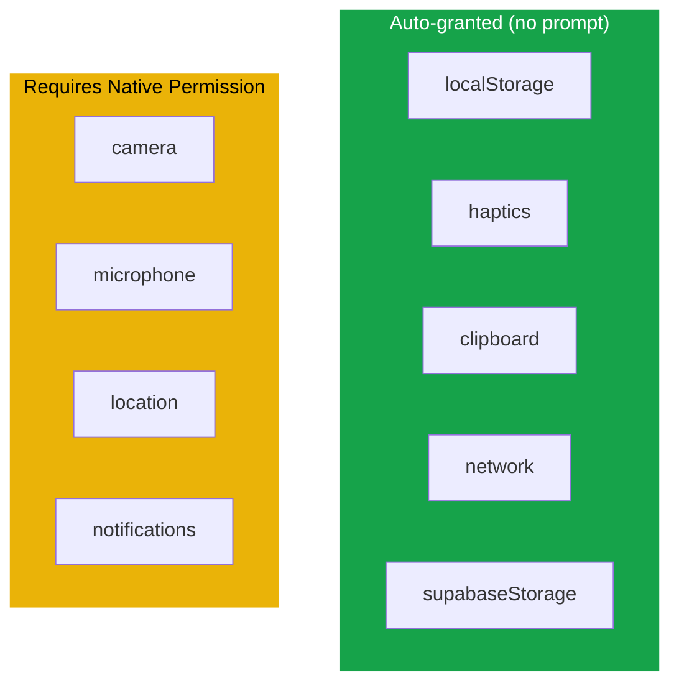
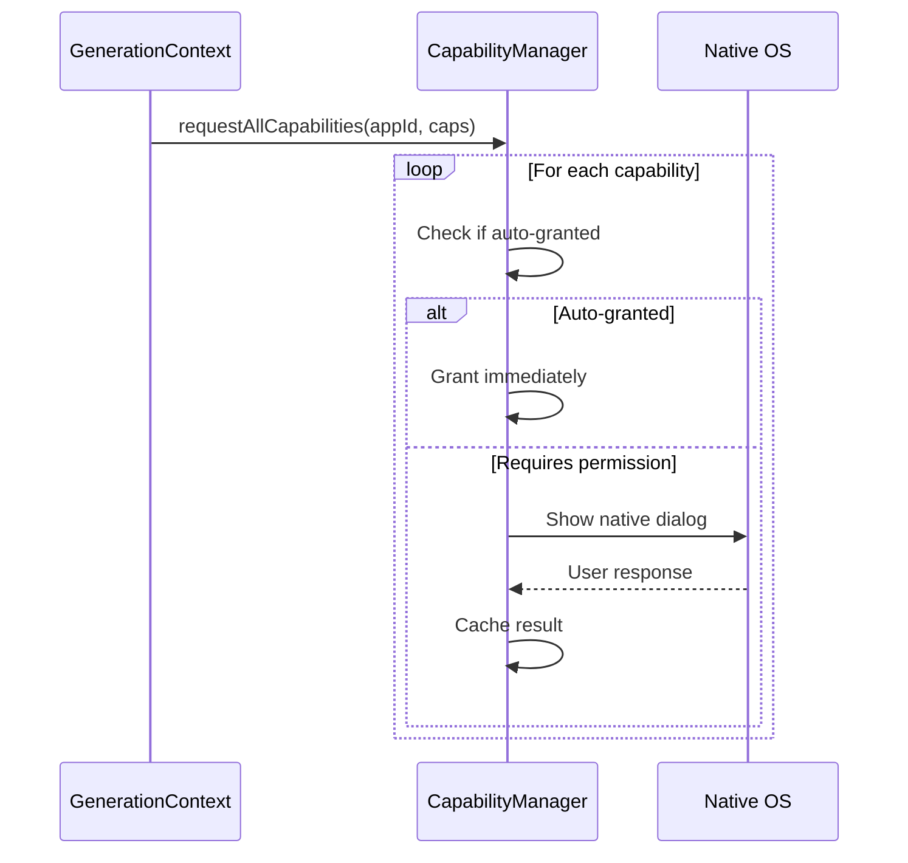

# Capabilities

Capabilities are the permission model for mini-apps. Each app declares what native features it needs, and the system requests appropriate permissions from the user.

## Available Capabilities



| Capability | Auto-granted | Native Dialog | Used By |
|-----------|-------------|---------------|---------|
| `localStorage` | Yes | No | State persistence |
| `haptics` | Yes | No | Vibration feedback |
| `clipboard` | Yes | No | Copy/paste |
| `network` | Yes | No | HTTP requests |
| `supabaseStorage` | Yes | No | Cloud sync |
| `camera` | No | Yes | `cameraView` component |
| `microphone` | No | Yes | `audioRecorder` component |
| `location` | No | Yes | `mapView` component |
| `notifications` | No | Yes | Push notifications |

## How It Works

### Declaration

Capabilities are declared in the mini-app spec:

```json
{
  "appId": "bird-classifier",
  "name": "Bird Classifier",
  "capabilities": ["camera", "localStorage", "network"],
  "screens": [...]
}
```

### Request Flow



### Persistence

Permission results are cached per-app in AsyncStorage:

```
Key: perm:{appId}:{capability}
Value: "granted" | "denied"
```

The in-memory cache provides synchronous access after initial load.

## Usage in Components

Components that require capabilities:

| Component | Required Capability |
|-----------|-------------------|
| `cameraView` | `camera` |
| `audioRecorder` | `microphone` |
| `mapView` (user location) | `location` |

Actions that require capabilities:

| Action | Required Capability |
|--------|-------------------|
| `http` | `network` |
| `serverCall` | `network` |
| `haptic` | `haptics` |
| `copyToClipboard` | `clipboard` |
