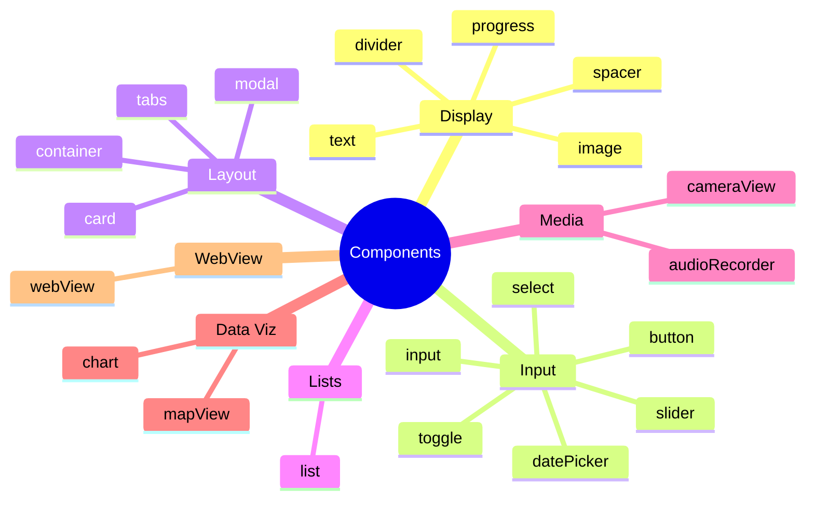

# Component Reference

SwissKnife v2 defines **21 component types** organized into 7 categories. All components support optional `visibleWhen` for conditional rendering.

## Component Map



## Display Components

### `text`

Renders styled text with variant support.

```json
{
  "type": "text",
  "text": "Hello World",
  "variant": "title",
  "style": { "color": "#ffffff", "textAlign": "center" }
}
```

| Property | Type | Required | Description |
|----------|------|----------|-------------|
| `text` | string | Yes | Static text content |
| `stateKey` | string | No | Dynamic text from state |
| `variant` | `"title"` \| `"subtitle"` \| `"body"` \| `"caption"` | No | Text size/weight |
| `style` | object | No | Custom styles (color, fontSize, textAlign, etc.) |

### `image`

Displays an image from a URL or state key.

```json
{
  "type": "image",
  "uri": "https://example.com/photo.jpg",
  "height": 200,
  "style": { "borderRadius": 12 }
}
```

| Property | Type | Required | Description |
|----------|------|----------|-------------|
| `uri` | string | No | Static image URL |
| `stateKey` | string | No | Image URL from state |
| `width` | number | No | Width in pixels |
| `height` | number | No | Height in pixels |

### `divider`

Horizontal line separator.

```json
{ "type": "divider" }
```

### `spacer`

Vertical empty space.

```json
{ "type": "spacer", "height": 24 }
```

| Property | Type | Required | Description |
|----------|------|----------|-------------|
| `height` | number | No | Height in pixels (default: 16) |

### `progress`

Progress bar or circular indicator.

```json
{
  "type": "progress",
  "stateKey": "completion",
  "max": 100,
  "label": "Progress",
  "variant": "bar"
}
```

| Property | Type | Required | Description |
|----------|------|----------|-------------|
| `stateKey` | string | Yes | Current value from state |
| `max` | number | No | Maximum value (default: 100) |
| `label` | string | No | Label text |
| `variant` | `"bar"` \| `"circle"` | No | Display style |

---

## Input Components

### `button`

Triggers an action on press.

```json
{
  "type": "button",
  "label": "Add Item",
  "action": { "type": "append", "target": "items", "value": { "name": "New" } },
  "variant": "primary"
}
```

| Property | Type | Required | Description |
|----------|------|----------|-------------|
| `label` | string | Yes | Button text |
| `action` | Action | Yes | Action to dispatch on press |
| `variant` | `"primary"` \| `"secondary"` \| `"danger"` | No | Visual style |
| `style` | object | No | Custom styles |

### `input`

Text input bound to a state key.

```json
{
  "type": "input",
  "stateKey": "username",
  "placeholder": "Enter your name",
  "inputType": "text"
}
```

| Property | Type | Required | Description |
|----------|------|----------|-------------|
| `stateKey` | string | Yes | State key to bind to |
| `placeholder` | string | No | Placeholder text |
| `label` | string | No | Label above input |
| `inputType` | `"text"` \| `"number"` \| `"email"` | No | Keyboard type |
| `multiline` | boolean | No | Enable multiline input |

### `slider`

Numeric slider with optional +/- buttons.

```json
{
  "type": "slider",
  "stateKey": "volume",
  "min": 0,
  "max": 100,
  "step": 1,
  "label": "Volume"
}
```

| Property | Type | Required | Description |
|----------|------|----------|-------------|
| `stateKey` | string | Yes | State key to bind to |
| `min` | number | Yes | Minimum value |
| `max` | number | Yes | Maximum value |
| `step` | number | No | Step increment |
| `label` | string | No | Label text |

### `toggle`

Boolean switch bound to state.

```json
{
  "type": "toggle",
  "stateKey": "darkMode",
  "label": "Dark Mode"
}
```

| Property | Type | Required | Description |
|----------|------|----------|-------------|
| `stateKey` | string | Yes | Boolean state key |
| `label` | string | No | Label text |

### `select`

Dropdown picker with predefined options.

```json
{
  "type": "select",
  "stateKey": "category",
  "options": [
    { "label": "Work", "value": "work" },
    { "label": "Personal", "value": "personal" }
  ],
  "placeholder": "Select category"
}
```

| Property | Type | Required | Description |
|----------|------|----------|-------------|
| `stateKey` | string | Yes | State key to bind to |
| `options` | `{ label, value }[]` | Yes | Available options |
| `placeholder` | string | No | Placeholder text |
| `label` | string | No | Label text |

### `datePicker`

Date/time selector using native picker.

```json
{
  "type": "datePicker",
  "stateKey": "deadline",
  "mode": "date",
  "label": "Due Date"
}
```

| Property | Type | Required | Description |
|----------|------|----------|-------------|
| `stateKey` | string | Yes | State key (ISO string) |
| `mode` | `"date"` \| `"time"` \| `"datetime"` | No | Picker mode |
| `label` | string | No | Label text |

---

## Layout Components

Layout components accept `children` — arrays of nested components rendered via `renderChild`.

### `container`

Flexbox layout wrapper.

```json
{
  "type": "container",
  "direction": "row",
  "gap": 12,
  "padding": 16,
  "children": [
    { "type": "text", "text": "Left" },
    { "type": "text", "text": "Right" }
  ]
}
```

| Property | Type | Required | Description |
|----------|------|----------|-------------|
| `children` | Component[] | Yes | Nested components |
| `direction` | `"row"` \| `"column"` | No | Flex direction |
| `gap` | number | No | Gap between children |
| `padding` | number | No | Internal padding |
| `align` | string | No | alignItems value |
| `justify` | string | No | justifyContent value |
| `style` | object | No | Custom styles |

### `card`

Elevated card with optional header.

```json
{
  "type": "card",
  "title": "Stats",
  "subtitle": "This week",
  "children": [
    { "type": "text", "stateKey": "weeklyTotal" }
  ]
}
```

| Property | Type | Required | Description |
|----------|------|----------|-------------|
| `children` | Component[] | Yes | Nested components |
| `title` | string | No | Card title |
| `subtitle` | string | No | Card subtitle |
| `style` | object | No | Custom styles |

### `tabs`

Tab bar with switchable content panels.

```json
{
  "type": "tabs",
  "tabs": [
    { "label": "Active", "children": [...] },
    { "label": "Completed", "children": [...] }
  ]
}
```

| Property | Type | Required | Description |
|----------|------|----------|-------------|
| `tabs` | `{ label, children }[]` | Yes | Tab definitions |

### `modal`

Overlay dialog driven by a boolean state key.

```json
{
  "type": "modal",
  "stateKey": "showConfirm",
  "title": "Confirm Delete",
  "children": [
    { "type": "text", "text": "Are you sure?" },
    { "type": "button", "label": "Yes", "action": { "type": "remove", "target": "items", "index": 0 } }
  ]
}
```

| Property | Type | Required | Description |
|----------|------|----------|-------------|
| `stateKey` | string | Yes | Boolean state key (open/close) |
| `children` | Component[] | Yes | Modal content |
| `title` | string | No | Modal title |

---

## List Component

### `list`

Renders an array from state with a per-item template. Supports recursive component nesting.

```json
{
  "type": "list",
  "dataKey": "todos",
  "renderItem": {
    "components": [
      { "type": "text", "text": "{{item.name}}" },
      { "type": "toggle", "stateKey": "{{item.done}}" }
    ]
  },
  "emptyText": "No items yet"
}
```

| Property | Type | Required | Description |
|----------|------|----------|-------------|
| `dataKey` | string | Yes | State key pointing to array |
| `renderItem` | `{ components }` | Yes | Template for each item |
| `emptyText` | string | No | Text when array is empty |

:::note Recursive Schema
`list.renderItem.components` can contain any component type, including nested containers and lists. The Zod schema uses `z.lazy()` for this recursion.
:::

---

## Media Components

### `cameraView`

Live camera preview with capture button.

```json
{
  "type": "cameraView",
  "stateKey": "photo",
  "facing": "back"
}
```

| Property | Type | Required | Description |
|----------|------|----------|-------------|
| `stateKey` | string | Yes | State key for captured image (base64) |
| `facing` | `"front"` \| `"back"` | No | Camera direction |

**Requires:** `camera` capability.

### `audioRecorder`

Audio recording with start/stop controls.

```json
{
  "type": "audioRecorder",
  "stateKey": "recording"
}
```

| Property | Type | Required | Description |
|----------|------|----------|-------------|
| `stateKey` | string | Yes | State key for recording URI |

**Requires:** `microphone` capability.

---

## Data Visualization

### `chart`

Bar, line, or pie chart.

```json
{
  "type": "chart",
  "chartType": "bar",
  "dataKey": "monthlyData",
  "labelKey": "month",
  "valueKey": "amount",
  "title": "Monthly Revenue"
}
```

| Property | Type | Required | Description |
|----------|------|----------|-------------|
| `chartType` | `"bar"` \| `"line"` \| `"pie"` | Yes | Chart type |
| `dataKey` | string | Yes | State key pointing to data array |
| `labelKey` | string | Yes | Property for labels |
| `valueKey` | string | Yes | Property for values |
| `title` | string | No | Chart title |

### `mapView`

Map display with optional markers.

```json
{
  "type": "mapView",
  "stateKey": "location",
  "markersKey": "pins",
  "height": 300
}
```

| Property | Type | Required | Description |
|----------|------|----------|-------------|
| `stateKey` | string | No | Center location `{ lat, lng }` |
| `markersKey` | string | No | State key for marker array |
| `height` | number | No | Map height in pixels |

**Requires:** `location` capability (for user location).

---

## Conditional Rendering

Every component supports `visibleWhen` to conditionally show/hide:

```json
{
  "type": "text",
  "text": "Welcome back!",
  "visibleWhen": {
    "stateKey": "isLoggedIn",
    "operator": "eq",
    "value": true
  }
}
```

**Operators:** `eq`, `neq`, `gt`, `lt`, `gte`, `lte`, `truthy`, `falsy`, `contains`

---

## WebView Component

### `webView`

Renders HTML/CSS/JavaScript content in a sandboxed WebView. Supports bidirectional communication with the native app through a controlled bridge API. Compliant with Apple App Store Guideline 4.7 (HTML5 mini-apps).

```json
{
  "type": "webView",
  "props": {
    "html": "<div>Hello World</div>",
    "height": 400,
    "stateKeys": ["user", "items"],
    "allowBridge": true,
    "onMessage": {
      "type": "setState",
      "key": "webViewData",
      "value": "{{__webViewMessage}}"
    }
  }
}
```

| Property | Type | Required | Description |
|----------|------|----------|-------------|
| `html` | string | No | Inline HTML content to render |
| `htmlKey` | string | No | State key containing HTML content (alternative to `html`) |
| `height` | number | No | Height in pixels (default: 400) |
| `stateKeys` | string[] | No | State keys to inject into WebView (accessible via `window.SwissKnife.getState()`) |
| `allowBridge` | boolean | No | Enable bridge API (default: true) |
| `onMessage` | Action | No | Action to dispatch when WebView sends a message |

**Bridge API:** When `allowBridge` is enabled, the WebView can access:

- `window.SwissKnife.getState(key?)` — Read state values
- `window.SwissKnife.setState(key, value)` — Update state
- `window.SwissKnife.dispatch(action)` — Dispatch a declarative action
- `window.SwissKnife.sendMessage(data)` — Send custom message to native
- `window.SwissKnife.onStateUpdate(callback)` — Listen for state updates

**Security:** The WebView runs in a sandboxed environment with:
- No external navigation (blocks all URLs except inline HTML)
- No file system access
- Validated bridge messages only
- No access to native APIs (camera, location, etc.) from WebView JavaScript
