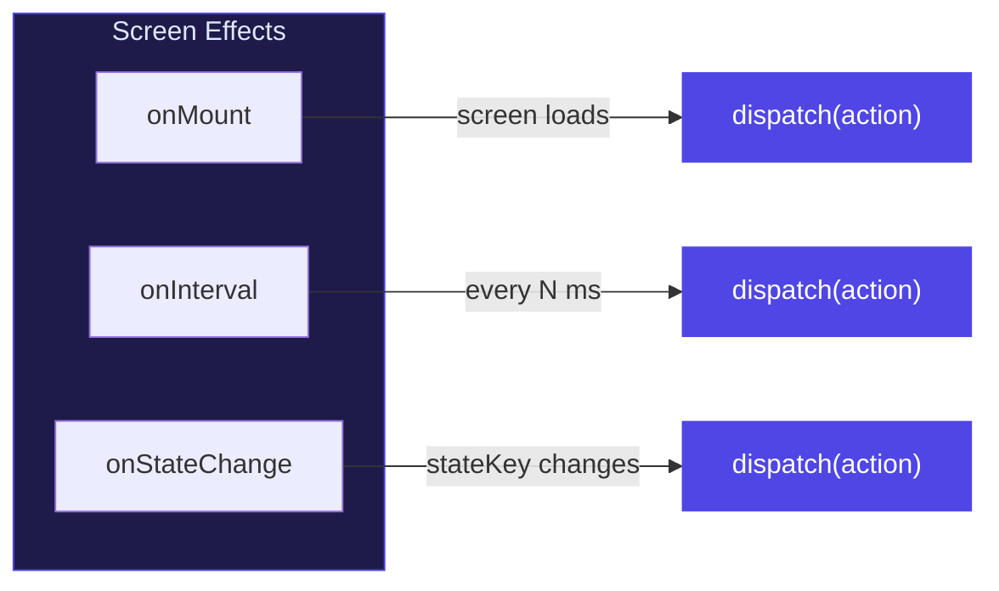
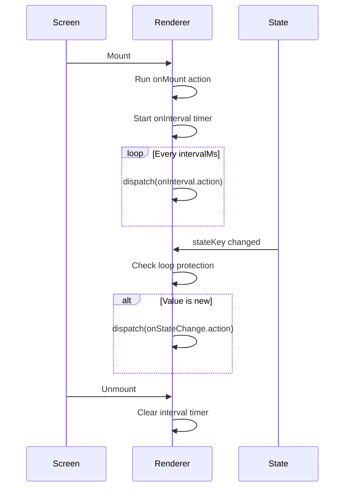

# Effects System

Effects are lifecycle hooks that run actions automatically — on mount, on interval, or when state changes. They are defined per-screen in the `effects` property.

## Effect Types



## `onMount`

Runs an action once when the screen first renders.

```json
{
  "effects": {
    "onMount": {
      "type": "http",
      "url": "https://api.example.com/init",
      "method": "GET",
      "resultKey": "initialData",
      "loadingKey": "loading"
    }
  }
}
```

**Common uses:**
- Fetch initial data from an API
- Set default state values
- Start a timer

## `onInterval`

Runs an action on a repeating interval.

```json
{
  "effects": {
    "onInterval": {
      "intervalMs": 1000,
      "action": {
        "type": "compute",
        "operation": "decrement",
        "target": "timeLeft",
        "by": 1
      }
    }
  }
}
```

| Property | Type | Description |
|----------|------|-------------|
| `intervalMs` | number | Milliseconds between each tick |
| `action` | Action | Action to dispatch each interval |

**Common uses:**
- Countdown timers
- Polling for updates
- Auto-refresh data

:::tip Cleanup
The renderer automatically clears intervals when the screen unmounts or the component is destroyed. No manual cleanup needed.
:::

## `onStateChange`

Runs an action whenever a specific state key changes value.

```json
{
  "effects": {
    "onStateChange": {
      "stateKey": "selectedCategory",
      "action": {
        "type": "http",
        "url": "https://api.example.com/items?cat={{selectedCategory}}",
        "method": "GET",
        "resultKey": "items",
        "loadingKey": "loadingItems"
      }
    }
  }
}
```

| Property | Type | Description |
|----------|------|-------------|
| `stateKey` | string | State key to watch |
| `action` | Action | Action to dispatch on change |

:::warning Loop Protection
The renderer tracks the last dispatched value to prevent infinite loops. If `onStateChange` triggers a `setState` on the same key, the effect won't re-fire.
:::

## Full Example

A screen that loads data on mount, refreshes every 30 seconds, and re-filters when a category changes:

```json
{
  "id": "dashboard",
  "title": "Dashboard",
  "components": [...],
  "effects": {
    "onMount": {
      "type": "http",
      "url": "https://api.example.com/stats",
      "method": "GET",
      "resultKey": "stats",
      "loadingKey": "loading"
    },
    "onInterval": {
      "intervalMs": 30000,
      "action": {
        "type": "http",
        "url": "https://api.example.com/stats",
        "method": "GET",
        "resultKey": "stats"
      }
    },
    "onStateChange": {
      "stateKey": "filter",
      "action": {
        "type": "http",
        "url": "https://api.example.com/stats?filter={{filter}}",
        "method": "GET",
        "resultKey": "stats",
        "loadingKey": "filtering"
      }
    }
  }
}
```

## Effects Lifecycle


