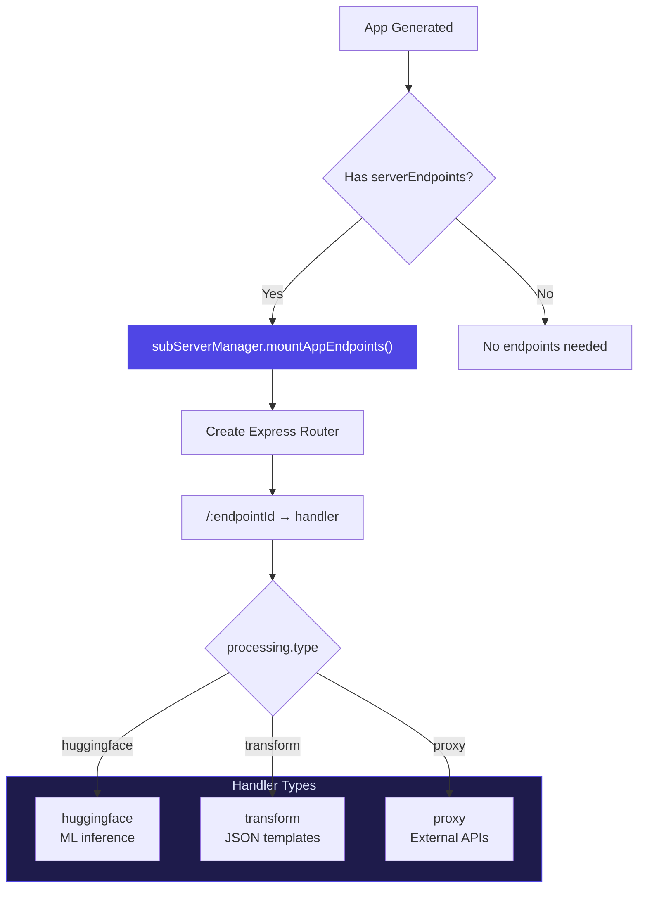
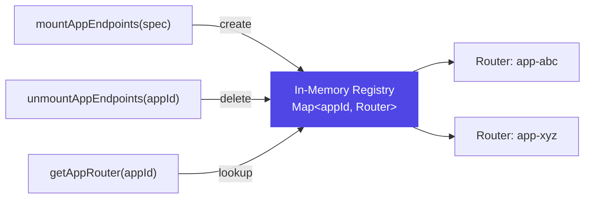

# Per-App Server Endpoints

When a v2 mini-app defines `serverEndpoints`, the server creates dynamic routes scoped to that app. These enable ML inference, data transformation, and proxied API calls.

## How It Works



## Endpoint Definition

In the mini-app spec:

```json
{
  "serverEndpoints": [
    {
      "id": "classify-bird",
      "method": "POST",
      "processing": {
        "type": "huggingface",
        "model": "google/vit-base-patch16-224",
        "inputType": "image"
      }
    }
  ]
}
```

## Request Path

App-side `serverCall` action → HTTP request:

```
POST /api/apps/{appId}/endpoints/{endpointId}
```

## Handler Types

### HuggingFace (`huggingface`)

Forwards requests to the HuggingFace Inference API for ML tasks.

```json
{
  "type": "huggingface",
  "model": "google/vit-base-patch16-224",
  "inputType": "image"
}
```

| Property | Description |
|----------|-------------|
| `model` | HuggingFace model ID |
| `inputType` | `"image"` (base64) or `"text"` (JSON) |

**Requires:** `HUGGINGFACE_API_KEY` environment variable.

### Transform (`transform`)

Applies a JSON template with `{{key}}` placeholder interpolation.

```json
{
  "type": "transform",
  "template": {
    "formatted": "Hello, {{name}}! You have {{count}} items."
  }
}
```

Request body values replace `{{placeholders}}` in the template.

### Proxy (`proxy`)

Forwards requests to whitelisted external APIs.

```json
{
  "type": "proxy",
  "targetUrl": "https://api.openweathermap.org/data/2.5/weather?q={{city}}&appid={{apiKey}}",
  "method": "GET"
}
```

**Whitelisted domains:**
- `api-inference.huggingface.co`
- `api.openweathermap.org`
- `jsonplaceholder.typicode.com`
- `pokeapi.co`
- `api.github.com`

Any request to a non-whitelisted domain is rejected with a 403 error.

## Subserver Manager

**File:** `server/src/services/subServerManager.ts`

Maintains an in-memory `Map<appId, Router>`:



- **`mountAppEndpoints(spec)`** — Creates a new Express router with handlers for each endpoint
- **`unmountAppEndpoints(appId)`** — Removes the router (called before re-mounting on modify)
- **`getAppRouter(appId)`** — Returns the router for request dispatch

:::note Ephemeral Endpoints
Endpoints exist only in memory. They are recreated each time the server starts or when an app is generated/modified. They are not persisted to disk.
:::
