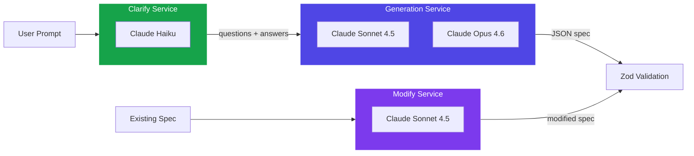
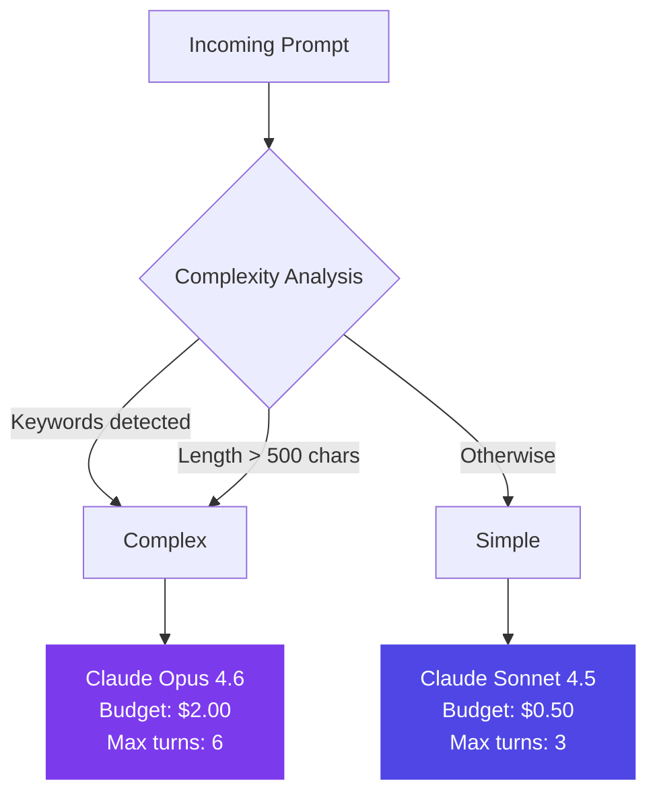
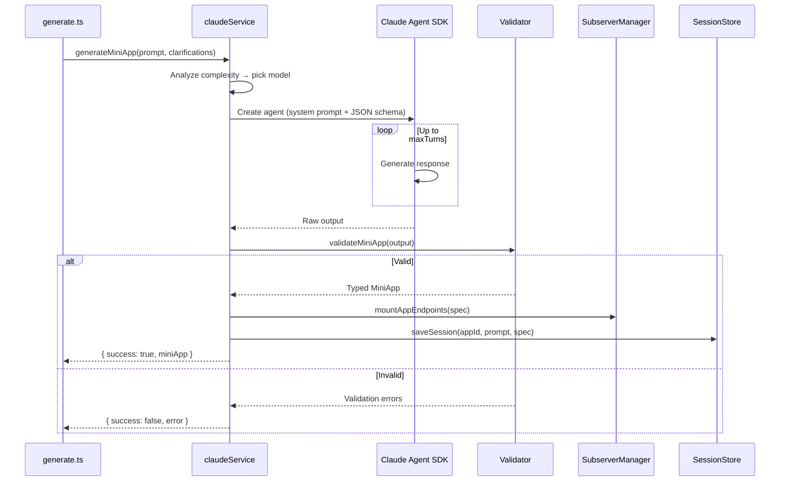

# AI Generation

The server uses three Claude-powered services for different stages of the pipeline.

## Service Overview



## Clarify Service

**File:** `server/src/services/clarifyService.ts`

Uses Claude Haiku (fast, cheap) to generate 3 clarification questions before generation.

- **Model:** Claude Haiku
- **Output:** JSON with `summary` + `questions[]` (single/multiple/freeform)
- **Prompt:** Aware of SwissKnife capabilities, matches user's language

```json
{
  "summary": "A workout tracker with exercise logging",
  "questions": [
    {
      "type": "single",
      "question": "What kind of exercises?",
      "options": ["Weightlifting", "Cardio", "Both"]
    }
  ]
}
```

## Generation Service

**File:** `server/src/services/claudeService.ts`

The core generation engine. Uses Claude Agent SDK with structured JSON output.

### Model Selection



**Complexity keywords:** camera, photo, ML, classify, chart, graph, map, location, audio, record, timer, interval, api, fetch, HuggingFace

### Generation Pipeline



### System Prompt

**File:** `server/src/prompts/masterPrompt.ts` (570 lines)

The master prompt documents:
- All 21 component types with property details
- All 15 action types with usage patterns
- Theme system
- Effects system
- Server endpoints
- 4 complete example apps (counter, workout tracker, bird identifier, pomodoro)

Ends with the critical instruction: **"Output ONLY valid JSON. No markdown, no explanations."**

### Structured Output

The service uses Claude's JSON schema output mode:

```typescript
outputFormat: {
  type: "json_schema",
  schema: miniAppJsonSchema  // From validation/jsonSchema.ts
}
```

If structured output fails, the service falls back to `extractJSON()` which strips markdown fences and parses raw text.

## Modify Service

**File:** `server/src/services/modifyService.ts`

Modifies an existing spec based on a user prompt. The current spec is embedded in the system prompt.

- **Model:** Claude Sonnet 4.5
- **Budget:** $1.50, max 3 turns
- **Key behavior:** Preserves `appId` (forced back if Claude changes it)
- **Prompt:** Built dynamically from `modifyPrompt.ts` with the current spec JSON

## Validation

**File:** `server/src/validation/schemaValidator.ts`

Two-stage validation:

1. **`extractJSON(text)`** — Strip markdown fences, find JSON boundaries, parse
2. **`validateMiniApp(raw)`** — Parse with Zod `MiniAppSchema`, return typed result or detailed errors

The Zod schema catches:
- Unknown component types
- Missing required fields
- Invalid enum values
- Malformed action objects
- Incorrect nesting
