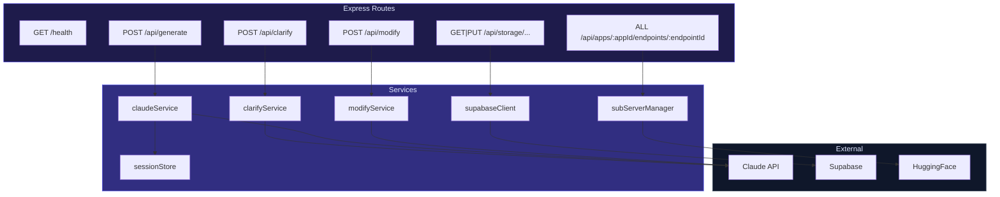

# Server Package

**Location:** `server/src/`
**Stack:** Express.js, Claude API (Anthropic), Supabase, TypeScript

The server handles AI generation, spec validation, cloud storage, and per-app endpoint routing.

## Architecture



## Entry Point

**File:** `server/src/index.ts`

- Express app with CORS enabled
- JSON body parser (10MB limit)
- Request/response logging middleware (ID, timing, size)
- Color-coded logger utility

## Routes

| Method | Path | Handler | Purpose |
|--------|------|---------|---------|
| `GET` | `/health` | Inline | Health check |
| `POST` | `/api/clarify` | `clarify.ts` | Get clarification questions |
| `POST` | `/api/generate` | `generate.ts` | Generate mini-app spec |
| `POST` | `/api/modify` | `modify.ts` | Modify existing spec |
| `ALL` | `/api/apps/:appId/endpoints/:endpointId` | `apps.ts` | Per-app dynamic endpoints |
| `GET` | `/api/storage/apps/:appId/spec` | `storage.ts` | Load app spec |
| `PUT` | `/api/storage/apps/:appId/spec` | `storage.ts` | Save app spec |
| `GET` | `/api/storage/apps/:appId/state` | `storage.ts` | Load app state |
| `PUT` | `/api/storage/apps/:appId/state` | `storage.ts` | Save app state |
| `GET` | `/api/sessions` | `storage.ts` | List debug sessions |

## Services

| Service | File | Purpose |
|---------|------|---------|
| Claude Generation | `claudeService.ts` | Generate specs via Agent SDK |
| Clarification | `clarifyService.ts` | Pre-generation questions via Haiku |
| Modification | `modifyService.ts` | Modify specs via Agent SDK |
| Subserver Manager | `subServerManager.ts` | Per-app endpoint registry |
| Session Store | `sessionStore.ts` | Debug session persistence |
| Supabase Client | `supabaseClient.ts` | Cloud storage operations |

## Middleware

### Request Logging

Every request gets a unique ID and is logged with timing:

```
→ [abc123] POST /api/generate (1.2kb)
← [abc123] 200 (3452ms, 8.7kb)
```

### Auth Resolution

**File:** `server/src/utils/auth.ts`

`getUserId(req)` extracts the user identity:
1. Check `Authorization: Bearer <token>` → verify JWT → return `sub` claim
2. Fallback to `x-device-id` header → return `device:{id}`
3. Neither present → return `null`

## Environment Variables

| Variable | Required | Description |
|----------|----------|-------------|
| `ANTHROPIC_API_KEY` | Yes | Claude API access |
| `HUGGINGFACE_API_KEY` | For ML endpoints | HuggingFace Inference API |
| `SUPABASE_URL` | For storage | Supabase project URL |
| `SUPABASE_SERVICE_ROLE_KEY` | For storage | Supabase service role key |
| `SUPABASE_JWT_SECRET` | For auth | JWT verification secret |
| `PORT` | No | Server port (default: 3001) |
